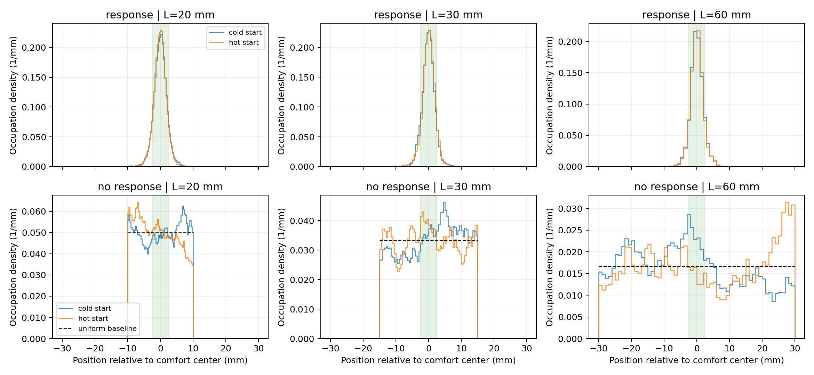

# 第一阶段：边界距离与长时占据分布

本实验在原有点模型上检查：趋温表现是否依赖反射边界距离，以及选定后期时间块的占据分布是否仍随时间或初态变化。原始 core、速度、感知和控制方法保持不变。

## 运行前固定的设计

设计保存于 `configs/phase1_boundary_stationarity.json`。域长 20、30、60 mm，舒适温度位置设在各域中点 10、15、30 mm。温度梯度固定 100 K/m，舒适半宽 0.25 K，因此舒适带物理宽度始终为 5 mm。冷热起点分别在中心相对位置 −7、+7 mm，控制了到舒适带的初始距离。此处与此前 30 mm 域中距中心 12 mm 的初态不同，不能把到达指标直接当作此前实验的重复。

每域冷热初态各 32 对，共 192 对、384 条轨迹；每对响应组与零增益对照共享 sensor、initial_state、controller 种子，条件之间使用独立种子段。每条运行 3600 s，分析 1800–2400、2400–3000、3000–3600 s 三块。感知周期 0.1 s，控制周期 0.2 s；物理积分步长 0.1 s 在正式运行前与 0.01 s 对照。每个运动段按几何重叠精确积分箱内时间，反射步调用原 core 分段，不将采样点频率当作精确驻留。

每域 60 个等宽箱；不同域的箱物理宽度分别为 1/3、1/2、1 mm。因此域间的 TV 数值不可直接解读为同一物理分辨率的差别，跨域比较主要依靠固定 5 mm 舒适带驻留。图横坐标使用相对舒适中心的毫米位置，纵坐标为每毫米概率密度。

## 指标和判据

对相邻时间块，以同一轨迹配对重采样；冷热初态比较分别独立重采样。每次取完整轨迹块，避免把高度相关的时刻当作独立样本。标量驻留差报告 4000 次 percentile bootstrap 区间。

总变差距离 TV 为两个离散占据分布绝对差之和的一半。运行前固定探索筛查阈值为 TV 0.10、驻留差 0.05。仅当 TV 重采样范围上界小于 0.10，且驻留差区间完全包含于 −0.05 至 +0.05，记录“该项满足有限时稳定筛查”。TV 是非负且非光滑的范数，在真实差接近零时 percentile bootstrap 有正偏；输出字段 `TV_bootstrap95` 指重采样统计量的中间 95% 范围，不能解释为严格覆盖区间、正式等价检验或稳态证明。未满足阈值也不能据此证明分布继续变化，可能是样本精度不足。

零响应基准是连续反射持久游走的均匀位置分布；舒适驻留基准为 5 mm / 域长。RMS 理论值为 G L / sqrt(12)。程序现有 `rms_K_by_block` 对每条轨迹的 RMS 求均值，而均匀理论对所有时刻的二阶矩开根，二者不同。因此与理论比较时另用 pooled RMS：先平均各条 RMS 的平方再开根。冷热初态占据分布必须分别看，不能仅用混合均值接近均匀判断混合完成。

根据连续零响应扩散近似 D₀ = v²/(2λ₀)，最慢空间模的混合时间约 L²/(π²D₀)，对应域长约 203、456、1824 s。最大域的后期块只有约一个至两个混合时间，残留初态效应是本设计需要检查的实际限制。此估计是无响应连续模型的量级基准，并不用于预先保证记忆控制系统混合。

## 结果与验证

正式实验完成 **192 对、384 条轨迹**，每条 3600 s，共三个域长。核心运行耗时 333.8 s。下面为最后一个 3000–3600 s 时间块。

|域长|响应驻留|零响应驻留|配对驻留提升及 bootstrap 区间|均匀驻留基准|
|---|---:|---:|---:|---:|
|20 mm|82.33%|24.90%|57.43 pp [54.09, 60.85]|25.00%|
|30 mm|82.86%|18.54%|64.32 pp [60.45, 68.11]|16.67%|
|60 mm|82.19%|9.40%|72.79 pp [68.35, 76.66]|8.33%|

三个域中响应组最后一块舒适驻留均约 82%–83%，且配对提升区间均为正。在本次测试范围内，集中在舒适区的现象保持存在；尚未进行跨域正式等价检验。

响应组六个相邻块比较均满足运行前固定筛查；三个域最后块的冷热初态比较也均满足筛查。此前块中 20 mm 的第一块、30 mm 的第二块、60 mm 的第一块的初态比较未满足筛查，说明不能把所有后期诊断都写成通过。零响应组六个相邻块和九个初态比较均未满足筛查，既有有限样本精度的影响，也需注意最大域的混合时间。60 mm 域最后块冷热初态 TV 为 0.158，各初态与均匀分布 TV 均约 0.114；混合两种初态后接近均匀会掩盖这部分差别。

|域长|零响应最后块 pooled RMS|均匀理论 RMS|
|---|---:|---:|
|20 mm|0.5824 K|0.5774 K|
|30 mm|0.8540 K|0.8660 K|
|60 mm|1.7396 K|1.7321 K|

四项 120 s 的 0.01/0.1 s 门控中箱占据最大差 2.25×10⁻¹²；另用全新种子在 60 mm 热侧运行整段 3600 s 门控，响应/对照均通过，进入时间差不超过 2.28×10⁻¹¹ s，驻留差不超过 4.06×10⁻¹²，反向数完全相同。两个图已检查单位、布局与刻度。主进程独立复算全部 192 对、1152 个块的均值、TV、75 项标量 bootstrap 区间和 30 项 TV 重采样范围；又对每域冷热首对共 12 条 3600 s 轨迹重跑原 core，用独立墙面分段和一般箱交叠积分复核，均一致。全套测试 86 项通过（14 项既有依赖弃用警告）；复核证据位于 `docs/reports/assets/phase1-closure-2026-10-04/independent-recomputation.json`。

## 复算

命令：`MPLCONFIGDIR=/private/tmp/softworm-boundary-mpl PYTHONPATH=src python3 analysis/phase1_boundary_stationarity.py`。

完整固定设计、逐对种子和配置、三个后期块的完整箱占据分布、驻留、RMS，以及整条轨迹指标存于 `results/phase1-boundary-stationarity-2026-10-04/`。manifest 记录 source SHA256、Git revision、Python、时间和实际命令。该结果目录不纳入 Git；关键设计、原始逐对块数据、汇总、门控、manifest 与图已归档至 `docs/reports/assets/phase1-boundary-stationarity-2026-10-04/`。图由独立后处理脚本 `analysis/phase1_boundary_figures.py` 根据 summary 重建，其源与输入 hash 记录在 figure-manifest；不修改已运行的实验脚本。
