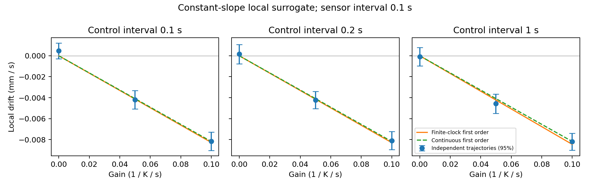

# 第一阶段：有限采样与控制周期的局部弱响应

日期：2026-10-04。本轮延续连续记忆推导，单独处理真实控制器的传感更新和 Bernoulli 翻向约定。模型为**局部固定误差斜率替代模型**，没有有限域边界、绝对误差尖点、噪声或死区；结果不直接等同于完整趋温任务的轨迹。

## 1. 固定设计与实现边界

传感周期固定 h_s=0.1 s，控制周期 h_c=0.1、0.2、1 s；基础翻向率 λ₀=0.1 s⁻¹，快慢记忆 τ_f=0.5 s、τ_s=5 s，速率 v=0.0002 m/s，局部误差斜率 b=100 K/m。每个周期分别检查增益 g=0、0.05、0.1 K⁻¹s⁻¹，各固定64条独立轨迹，共576条；舍弃前500 s，再测量30,000 s平均位移速度。配置在计算前保存，各格使用独立种子块，不跨增益作配对推断。

长轨迹以 z_i=m_i−e 为状态，避免无界固定斜率导致绝对误差跨过零或数值偏移过大。这里的 e 是局部线性误差延伸；它不在全域重新取绝对值。每个控制区间的朝向固定，传感更新可精确折叠为一次线性滞后递推。翻向仍采用核心的 p=1−exp(−λh_c)，每次控制至多翻向一次。

专门的契约检查实际调用 `TwoTimescaleTurnController.observe` 和 `should_turn`：输入 e₀=1000 K 的正误差，连续200 s，九个条件全部逐次核对记忆差、速率及同种子随机翻向。这个偏移仅用于代码契约测试，绝不是生物温度设置；没有修改核心或控制器内部记忆。长轨迹随机源为各独立种子的 NumPy PCG64，契约检查为核心 Python Random，相同的是更新与概率分布约定。真实核心检查与实验设计、原始数据均保存在 [证据目录](reports/assets/phase1-sampling-2026-10-04/)。

## 2. 精确的有限周期递推

令 q_i=exp(−h_s/τ_i)，Q_i=q_i^(h_c/h_s)。控制周期是传感周期的整数倍。若 s_n 是第 n 个区间的运动朝向，完成该区间所有传感更新后的滞后满足

\[
z_{i,n}=Q_i z_{i,n-1}-vbB_i s_n,\qquad
B_i=\frac{h_s q_i(1-Q_i)}{1-q_i}.\tag{1}
\]

式 (1) 是核心采样递推的代数折叠，没有把分段输入当连续指数记忆。初始化 z_i=0；因此 |z_i|≤v|b|B_i/(1−Q_i)。由 |I|=|z_s−z_f|≤|z_s|+|z_f|，本轮所有增益的速率都在约0.0892—0.1108 s⁻¹之间，严格位于设置的0和1 s⁻¹上下界内，故夹限不会改变递推。

在 g=0 时，控制事件后的朝向相关因子为

\[
r=1-2p_0=2e^{-\lambda_0 h_c}-1.\tag{2}
\]

定义 C_i=⟨s_n z_{i,n}⟩₀，注意 s_n 为本次决定之前的运动方向。上一周期记忆先经过上一次随机翻向再进入下一周期，所以 ⟨s_nz_{i,n−1}⟩₀=rC_i。将式 (1) 乘 s_n 并平均，得到

\[
C_i=-\frac{vbB_i}{1-Q_i r},\qquad
\langle sI\rangle_0=-vb\left(\frac{B_s}{1-Q_s r}-\frac{B_f}{1-Q_f r}\right).\tag{3}
\]

对翻向概率关于增益展开：p(I)=p₀−g h_c exp(−λ₀h_c)I+O(g²)。平稳方向均值满足 (1−r)⟨s⟩=2g h_c exp(−λ₀h_c)⟨sI⟩₀+O(g²)。于是有限时钟的一阶漂移为

\[
u=C_h g+O(g^2),\quad
C_h=-\frac{2v^2b h_c e^{-\lambda_0h_c}}{1-r}
\left(\frac{B_s}{1-Q_s r}-\frac{B_f}{1-Q_f r}\right).\tag{4}
\]

式 (4) 对给定有限采样与控制时钟的一阶系数精确；对非零增益仍是一阶近似。两个周期共同趋零时，退化为先前连续模型的系数 −v²b(τ_s−τ_f)/[λ₀(1+2λ₀τ_s)(1+2λ₀τ_f)]。

| 控制周期 / s | 有限周期 C_h / m·K | 相对连续系数的幅值变化 |
|---|---:|---:|
| 0.1 | −8.275464×10⁻⁵ | +1.145% |
| 0.2 | −8.293556×10⁻⁵ | +1.366% |
| 1.0 | −8.455968×10⁻⁵ | +3.351% |

连续系数为 −8.181818×10⁻⁵ m·K。C_h乘以g后得到m/s；h_s固定，因此这里并非单独改变控制周期后的一般连续极限。

## 3. 固定样本的数值结果

| h_c / s | g / K⁻¹s⁻¹ | 一阶预测 / mm·s⁻¹ | 实测 / mm·s⁻¹ | 均值标准误 / mm·s⁻¹ |
|---|---:|---:|---:|---:|
| 0.1 | 0 | 0 | +0.000476 | 0.000382 |
| 0.1 | 0.05 | −0.004138 | −0.004200 | 0.000452 |
| 0.1 | 0.1 | −0.008275 | −0.008159 | 0.000451 |
| 0.2 | 0 | 0 | +0.000154 | 0.000465 |
| 0.2 | 0.05 | −0.004147 | −0.004228 | 0.000416 |
| 0.2 | 0.1 | −0.008294 | −0.008096 | 0.000444 |
| 1.0 | 0 | 0 | −0.000080 | 0.000452 |
| 1.0 | 0.05 | −0.004228 | −0.004570 | 0.000471 |
| 1.0 | 0.1 | −0.008456 | −0.008204 | 0.000411 |

九个条件的实测均值与有限周期一阶预测相差不超过1.25个标准误。每个误差条为64个独立轨迹均值的正态近似95%区间；时间帧没有当作独立样本。非零响应产生朝负误差梯度方向的漂移，支持本次推导和实现的数值一致性。

当前样本精度无法单独分辨理论上1%—3%的有限周期修正：连续预测同样落入误差范围。这里不能把“有限周期式与模拟相符”写成“统计排除了连续式”。固定64条设计没有按计算结果追加样本；高阶增益偏差也未独立估计。本模型又关闭了噪声、死区、夹限，因此不能用于参考 g=4 的定量速度预测。

## 4. 复现与下一步

复现入口：`PYTHONPATH=src python3 analysis/phase1_sampling_response.py`。固定设计见 [design.json](reports/assets/phase1-sampling-2026-10-04/design.json)，576条独立轨迹均值和完整组统计见 [sampling-response.json](reports/assets/phase1-sampling-2026-10-04/sampling-response.json)，真实控制器契约见 [core-contract-gate.json](reports/assets/phase1-sampling-2026-10-04/core-contract-gate.json)。结果保存脚本、设计和核心源码的 SHA256。

局部机制已连接到有限时钟。全域下一步需要另外检查舒适点的绝对值尖点、反射边界和长期分布，不把局部恢复漂移直接代入位置单独的 Markov 方程。身体推进与耗散仍属于后续阶段。
