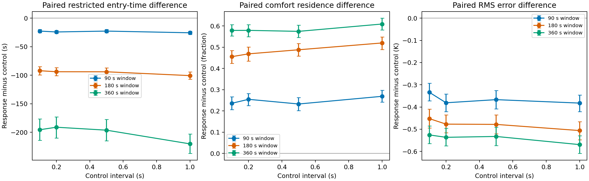
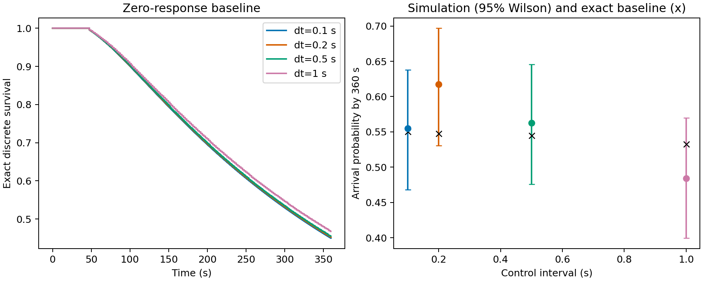

# 第一阶段：无响应解析基准与控制周期、观察时窗敏感性

本轮在既有一维点模型上补充机制解释与固定参数敏感性实验，核心默认配置保持不变。身体力学、身体柔软性与能耗尚未纳入。记忆滤波的尺度推导另见 [记忆与尺度分析](phase1-memory-scaling.md)。

## 1. 连续无响应极限：首次进入时间

设舒适区左边缘为 a，冷侧初始位置为 x₀∈[0,a)，速度大小 v>0。左端 x=0 反射，首次到达 x=a 即吸收。无响应连续 telegraph 过程以常数 λ 的 Poisson 事件反向。记 T₊(x)、T₋(x) 为正、负方向的平均首次进入时间，短时间展开给出后向方程：

$$
vT_+'+\lambda(T_--T_+)=-1,\qquad -vT_-'+\lambda(T_+-T_-)=-1. \tag{1}
$$

反射使 T₊(0)=T₋(0)，吸收边缘只需入射特征的 T₊(a)=0。T₋(a) 的内侧极限不设为零：从边缘内侧朝远离目标方向出发，需要再次返回。设 S=(T₊+T₋)/2、Q=T₊−T₋，相加与相减得到：

$$
Q'=-2/v,\qquad S'=\lambda Q/v,\qquad Q(0)=0. \tag{2}
$$

积分并使用 T₊(a)=S(a)+Q(a)/2=0，可得：

$$
S(x)=\frac{a}{v}+\frac{\lambda(a^2-x^2)}{v^2},\qquad T_\pm(x)=S(x)\mp\frac{x}{v}. \tag{3}
$$

参考场的舒适区为 [12.5,17.5] mm。a=12.5 mm、x₀=3 mm、v=0.2 mm/s、λ=0.1 s⁻¹，等概率初始方向给出 **S(x₀)=430.625 s**；正、负初始方向分别为 415.625 s 与 445.625 s。λ→0 时等概率方向均值 a/v=62.5 s，等于两条弹道路径时间的平均。λ 增大后，往返使第二项增长。有限180 s实验的限制平均首次进入时间不能直接拿来与这个未截断均值相等比较。

## 2. 当前离散控制与连续极限的区别

当前模拟仅在每个控制周期末反向一次，以概率：

$$
p_h=1-\exp(-\lambda h). \tag{4}
$$

它表示连续Poisson过程“至少一次事件”的概率。连续过程在一个周期内速度反向的奇数事件概率则是：

$$
p_{\mathrm{odd}}=\frac{1-\exp(-2\lambda h)}{2}. \tag{5}
$$

即使改用奇偶概率，仍不能复现周期内多次事件造成的位置变化，因此本轮只比较与验证现有模型，不修改核心规则。对于无限均匀空间、常数速率、控制边界观测的离散运动，方向相关为 (1−2p_h)ᵏ。长时间扩散系数为：

$$
D_h=\frac{v^2h(1-p_h)}{2p_h}=\frac{v^2h}{2[\exp(\lambda h)-1]},\qquad \lim_{h\to0}D_h=\frac{v^2}{2\lambda}. \tag{6}
$$

这解释了改变控制周期会改变无响应对照本身的离散运动。参考 λ=0.1 s⁻¹、h=1 s 时 p_h≈0.09516，而 p_odd≈0.09063；速率上限 λ=0.5 s⁻¹、h=1 s 时两者分别≈0.39347、0.31606。大控制周期与高反向率组合时，连续近似更弱。

## 3. 现有离散模型的概率传播基准

本轮无响应传播直接匹配现有实现。令空间步长 Δx=vh，保存未吸收格点 x=nΔx 的两方向概率质量。在每个周期先直线前进、在左端反射；首次跨越 x=a 的概率质量吸收，存下周期内精确跨越时刻；随后仅对幸存质量以 p_h 反向。反射在控制之前，与模拟一致。初始位置恰在格点上，舒适区边缘可以在格点之间，因此没有把边缘近似移到最近格点。每一步检查幸存概率与累计吸收质量总和为1。

该传播没有Monte Carlo误差；浮点误差与现有模拟舒适边缘约3×10⁻¹⁰ K的温度容差造成的时间差需要在核验时考虑。生存函数 S_h(t) 为尚未首次进入的概率，限制平均首次进入时间为：

$$
\operatorname{RMST}(H)=\mathbb E[\min(T,H)]=\int_0^H S_h(t)\,dt. \tag{7}
$$

基准与原模拟的无响应组比较到达率和RMST，而不会用430.625 s强行要求有限窗口结果一致。

## 4. 固定设计与配对边界

运行前写入 `configs/phase1_theory_sensitivity.json`：4 个控制周期（0.1、0.2、0.5、1.0 s）×3 个观察时窗（90、180、360 s），每格128对响应/无响应轨迹，共1,536对、3,072条轨迹。噪声0.05 K、快/慢记忆0.5/5 s、起点3 mm，其余参数为参考配置。物理/测温步长均0.1 s，物理加速先与0.01 s在两端控制周期及响应/无响应情况下核对。

新种子以 sensor=71000、initial_state=72000、controller=73000 为基数，加重复编号。每个重复在所有条件使用相同种子元组。同一控制周期下不同观察时窗具有相同轨迹前缀；不同控制周期消费控制随机数的时间与次数不同，因此跨周期配对仅是共同随机种子设计，不能称为相同连续Poisson驱动路径。

主要指标为到达率、RMST、舒适区停留比例与温差RMS。配对差为响应减无响应，按整对轨迹bootstrap 4,000次给出95%区间；到达率给出Wilson 95%区间。该网格是敏感性探索，未作多重比较校正，也不选择最优参数。

饱和与deadband只读取真实控制决策时刻 t>0且t<H 的速率及记忆改进量：对每条轨迹分别统计到达速率下限、上限，以及 |I|≤deadband 的决策比例，再等权平均。最终t=H的控制决策没有后续运动作用，明确排除；三种比例并非对所有物理记录帧平均。lower/upper指最终夹限速率相等，包含原始速率恰等于边界的情况。

## 5. 本轮实际结果

| 控制周期 / s | 时窗 / s | 响应到达率 | 无响应到达率 | 离散解析到达率 | 配对 RMST 差 / s（95%区间） | 停留比例差 |
|---:|---:|---:|---:|---:|---:|---:|
| 0.1 | 180 | 99.2% | 26.6% | 26.6% | -92.06 [-99.33, -84.74] | +0.456 |
| 0.1 | 360 | 100.0% | 55.5% | 55.0% | -195.60 [-214.11, -176.51] | +0.579 |
| 0.1 | 90 | 85.2% | 10.2% | 7.8% | -22.58 [-25.43, -19.67] | +0.236 |
| 0.2 | 180 | 100.0% | 30.5% | 26.4% | -93.87 [-100.78, -86.46] | +0.469 |
| 0.2 | 360 | 100.0% | 61.7% | 54.8% | -191.14 [-209.86, -172.83] | +0.579 |
| 0.2 | 90 | 83.6% | 7.0% | 7.8% | -24.13 [-26.81, -21.25] | +0.255 |
| 0.5 | 180 | 100.0% | 25.8% | 26.2% | -93.94 [-100.81, -87.21] | +0.488 |
| 0.5 | 360 | 100.0% | 56.2% | 54.5% | -196.30 [-214.74, -177.29] | +0.575 |
| 0.5 | 90 | 84.4% | 10.2% | 7.6% | -22.60 [-25.48, -19.68] | +0.233 |
| 1 | 180 | 100.0% | 21.9% | 25.3% | -100.64 [-107.01, -93.99] | +0.520 |
| 1 | 360 | 100.0% | 48.4% | 53.3% | -220.32 [-236.99, -202.87] | +0.609 |
| 1 | 90 | 85.9% | 7.8% | 7.3% | -25.56 [-28.28, -22.89] | +0.269 |

**观察时窗明显改变有限时间指标。** 90 s 响应到达率为83.6%—85.9%，180 s为99.2%—100%，360 s均为100%；无响应对应为7.0%—10.2%、21.9%—30.5%、48.4%—61.7%。每个控制周期在三个时窗均显示响应组更早进入、停留更多；延长时窗后对照持续首次进入，因而到达率差不能直接比较为稳态效应。12格均不是独立新种子，不能据此提高有效独立样本数。

**现有增益下，速率下限夹限不可忽略。** 90/180/360 s时窗的响应控制决策下限比例分别约67.8%—69.7%、47.7%—49.1%、36.5%—37.3%；上限比例均小于0.1%。这表明本轮处于显著非线性下限夹限区，弱响应公式应在小增益实验中另行检验。比例随时窗变化包含运动早期趋近与进入舒适区后行为占比变化。

| 控制周期 / s（180 s时窗） | 速率下限比例 | 速率上限比例 | deadband比例 |
|---:|---:|---:|---:|
| 0.1 | 49.126% | 0.040% | 9.430% |
| 0.2 | 48.840% | 0.036% | 9.657% |
| 0.5 | 47.745% | 0.020% | 10.668% |
| 1 | 48.097% | 0.039% | 10.532% |

**控制周期结果支持方向稳定，不支持选择最优周期。** 不同周期下响应效应方向一致，而每格128对产生的组间抽样差异可大于离散基准的周期变化；本轮没有为周期之间的因果差预设主比较，也没有进行最优周期选择。控制周期扫描同时改变离散反向概率、决策频率与决策读取的记忆状态。

数值加速4项核对全部通过，全部512个种子/控制周期组合的首次进入时间满足三个观察窗的前缀截断一致性。科研图已生成；独立复算与完整测试状态见本轮验证记录。

## 6. 来源与复现

执行入口：`PYTHONPATH=src MPLCONFIGDIR=/private/tmp/softworm-mpl python3 analysis/phase1_theory_sensitivity.py`。原始每对记录、已解析配置、统计、生存传播与运行清单保存在 `results/phase1-theory-sensitivity-2026-10-04/`。可分享的原始CSV、汇总、清单、加速核对与科研图另外归档至 `docs/reports/assets/phase1-theory-sensitivity-2026-10-04/`。所有表格数值来自本轮实际运行，无响应概率传播依赖同一固定配置，但独立于原模拟随机采样。

记忆尺度推导及连续局部弱响应系数的专门检验已完成，见 [记忆与尺度分析](phase1-memory-scaling.md)。本轮全部统计与诊断已 [独立复算通过](validation/phase1-theory-sensitivity-validation-2026-10-04.md)，完整测试76项通过。下一步比较有限采样核心的弱响应系数，并检验边界与更长时窗的分布收敛。当前响应增益实际频繁进入速率下限夹限区，不能把弱响应公式当本轮参数的定量结论。
