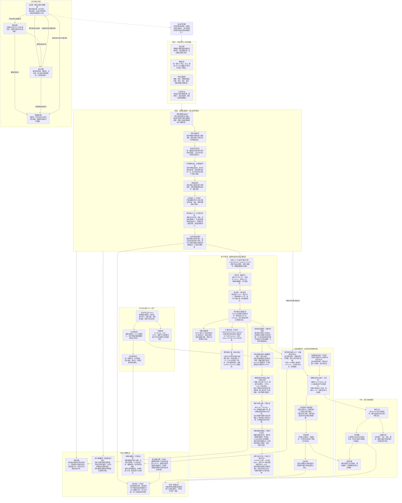

# 软体线虫趋温项目结构图

> 更新时间：2026-10-05
> 用途：展示研究主线、各阶段关系与当前并行协作方式；代码和模型结构变化后同步更新。

## 当前阶段与汇合条件

- **当前基线**：PR #1 已合并；阶段 0 已建立模型契约、局部传感边界、独立时钟、随机源和结果记录。
- **阶段0已复验**：时钟对齐、严格配置与观测权限属于既有64项测试；统计批次为67项，前一理论批次为76项，最新有限采样/占据积分检查后全套86项通过。
- **阶段 1 单轨迹链路已复验**：严格配置、线性场、局部含噪读数、双时间尺度误差记忆、有界泊松反向率、一维持续随机运动、分段反射及段内指标积分已通过；控制器没有位置、真实梯度或温度场访问权限，命令行重复结果包一致。
- **配对集合已实现并独立复验**：`phase1-ensemble` 的响应组和 `gain=0` 对照逐重复共享环境、传感、初态和控制种子；跨重复时传感、初态和控制种子按 `基值+i` 递增，当前确定性温度场的环境种子保持不变。既有模型测试为 `64 passed`，API 与 CLI 都拒绝非正整数重复数；本轮全套结果见下方独立复验。
- **配对统计原理**：共享随机条件可以减少初态、测量噪声和随机转向造成的组间波动。条件平均首次到达时间只统计已到达轨迹；限制平均使用 `min(首次到达时间, 观察时长)`，使未到达轨迹仍以完整观察时长进入统计。既有 40 对结果属于机制诊断；既有统计批次增加探索预扫描、独立种子确认样本和置信区间。既有 544 对结果已通过独立复算，当前完成状态为有限时窗统计结果。
- **三文件集合结果包**：输出目录只包含 `config.resolved.json`、`manifest.json` 和 `summary.json`。科学汇总保留两组汇总量、逐配对种子和精简指标，不保存完整轨迹；相同配置与重复数的 `summary.json` 可复现，运行清单中的创建时间随批次变化。
- **独立方向诊断**：40 对重复中，响应组与零响应组的到达率分别为 `1.000` 和 `0.325`，限制平均首次到达时间为 `70.98 s` 和 `163.87 s`，平均驻留比例为 `0.5235` 和 `0.0490`，平均 RMS 温差为 `0.5739 K` 和 `1.0666 K`。这些结果支持当前实现沿预期方向工作，不能替代后续正式统计推断。
- **统计分析层（已运行并独立复验）**：新增 `analysis/phase1_progress_scan.py`，3×3 预扫描每格 32 对；预设确认条件的冷热两侧各 128 对。扫描与确认使用分离种子，配对结构在每一批内部保留。
- **既有统计批次独立复验**：544 对共 1088 行记录、544 个独立种子元组；11 个条件的均值、Wilson 区间、配对 bootstrap 区间及生存曲线面积与 RMST 一致。各条件首对独立重跑逐值一致，设计、分析脚本与核心源码哈希匹配；全套测试 `67 passed`，最终统计脚本 3 项复验通过。
- **教师汇报生成层（已完成）**：`analysis/build_progress_report.py` 从已保存逐对指标与置信区间生成 Markdown、规范 artifact JSON 和 SQLite 可审计查询，供教师汇报与静态关键证据展示；不改变模型或仿真。HTML 通过现有报告工具打包，已完成结构验收，尚未进行 headless Chromium 渲染验收。
- **统计量的边界**：限制平均首次到达时间（RMST）描述给定观察时长内的到达表现，未到达轨迹按观察上限计入；有限时窗驻留比例不能直接称为稳态驻留概率。置信区间反映重复轨迹的不确定性，不能把一维点模型的差异解释为身体力学结果；冷热两侧有限样本的结果相近也不构成统计等价。
- **演示安排**：保留组员旧 Demo；新 Demo 任务已取消，美观优化留待后续。
- **控制周期与有限时窗诊断（已运行并独立复验）**：`analysis/phase1_theory_sensitivity.py` 对 4 个控制周期×3 个观察窗各运行 128 对，共 1,536 对/3,072 条条件内轨迹。12 格复用 128 个种子元组，非 1,536 个独立样本。各格响应组 RMST 更低且停留更多；参考 180 s 下限夹限约 47.7%—49.1%，上限小于 0.1%。匹配现有离散规则的概率传播提供无响应生存/RMST 基准，连续未截断均值 430.625 s 不与有限窗 RMST 等同。数值加速 4 项、512 个种子/周期的首次进入前缀截断核对通过；12 格原始均值、Wilson/配对 bootstrap 区间、离散概率传播、控制时刻诊断及 24 条轨迹独立重演通过；本轮完整回归 76 项通过。验证记录见 `docs/validation/phase1-theory-sensitivity-validation-2026-10-04.md`。
- **弱响应局部替代模型（已独立核验）**：`docs/phase1-memory-scaling.md` 推导朝向相关性修正后的漂移系数和无响应扩散系数；`analysis/phase1_weak_response.py` 以连续事件推进检验 4 个小增益、各 64 条轨迹。理论与数据均值相容，原始 256 条记录与 4 条独立重演通过；该模型关闭噪声、死区、夹限、边界及绝对值尖点，尚未验证有限采样核心的弱响应系数。
- **有限采样（已推导并复演）**：`analysis/phase1_sampling_response.py`完成576条局部轨迹，有限周期一阶系数与实测相符。主进程显式历史核求和复核系数，并实际调用核心重演3条完整30500s轨迹；参考速率界限未触发。关闭噪声、死区、夹限的局部系数不定量预测参考强响应。
- **边界与后期块（已完成探索与复核）**：`analysis/phase1_boundary_stationarity.py`在20/30/60mm域运行192对各3600s，保持初态距中心7mm；响应末块驻留82.33%/82.86%/82.19%。六项相邻块及三项最终冷热筛查通过，早期三项初态和无响应筛查未过。主进程独立复算1152块、75项标量区间和30项TV重采样范围，并重跑12条完整核心轨迹。TV重采样范围仅作探索筛查，未确立严格稳态。
- **当前核验与汇报**：完整测试86项通过。验证职责本轮由主进程的独立实现承担，见 `docs/validation/phase1-closure-validation-2026-10-04.md`；最新教师汇报见 `docs/reports/progress-2026-10-04-closure.md`。
- **身体机械基准（已实现并独立验证）**：`src/thermotaxis/phase2_body.py`由规定切角重建固定材料弧长身体，包含幅值/相位/偏置完整速度，以缩放3×3阻力矩阵求自由运动。`analysis/phase2_body_baseline.py`保存16组扫描、12组收敛、两轨迹和机械检查；独立12001材料点求解、几何有限差分与16项身体测试通过。身体基准102项、最新全套115项通过，参考4s净推进0.37914mm，耗散由独立工作阻力尺度确定。
- **当前汇报与证据**：最新全套115项通过，桥接核验见 `docs/validation/phase2-bridge-validation-2026-10-04.md`；最新正文 `docs/reports/progress-2026-10-04-body.md`，模型 `docs/phase2-prescribed-body.md`，验证 `docs/validation/phase2-body-validation-2026-10-04.md`，数据/图归档 `docs/reports/assets/phase2-body-2026-10-04/`。
- **四方向衔接（已实现）**：`phase2_control.py`把旧四方向命令转换为有限响应幅值/频率/偏置，连续求姿态与耗散；24s四方向、96s切换、渐停与步长比较已运行，材料头部与独立时钟已建立。`legacy_policy.py`支持冻结Q表/可选DQN，不训练、不修改权重；历史权重未找到，旧Worm2D新训练7200步接口样本已归档，实际接入44次指令、8.70s头部离域终止，未完成导航。旧策略使用额外信息，不能归为局部记忆策略。
- **接续顺序与未完成项**：接入舒适带任务下的身体局部记忆趋温，比较控制周期与实测转向时间；墙面接触、自交、弹性与阻力标定未完成。严格稳态、强响应解析可交错研究。
- **身体线与组员工作的关系**：沿用组员四方向编号、训练程序与Demo；新身体统一材料坐标与完整导数来核算转向和耗散。冻结策略适配已实现，旧程序原有能量终止和观测问题仍按历史版本记录；新模块没有宣称这些旧实现已修复。
- **两条研究线的汇合条件**：点模型的感知—记忆—转向机制通过独立统计验证，RFT 的运动学、力矩平衡、耗散与数值收敛通过独立物理验证。
- **最终研究关系**：先解释局部含噪信息怎样产生趋温，再研究身体形变和柔软性怎样改变信息获取、运动效果与机械代价。
