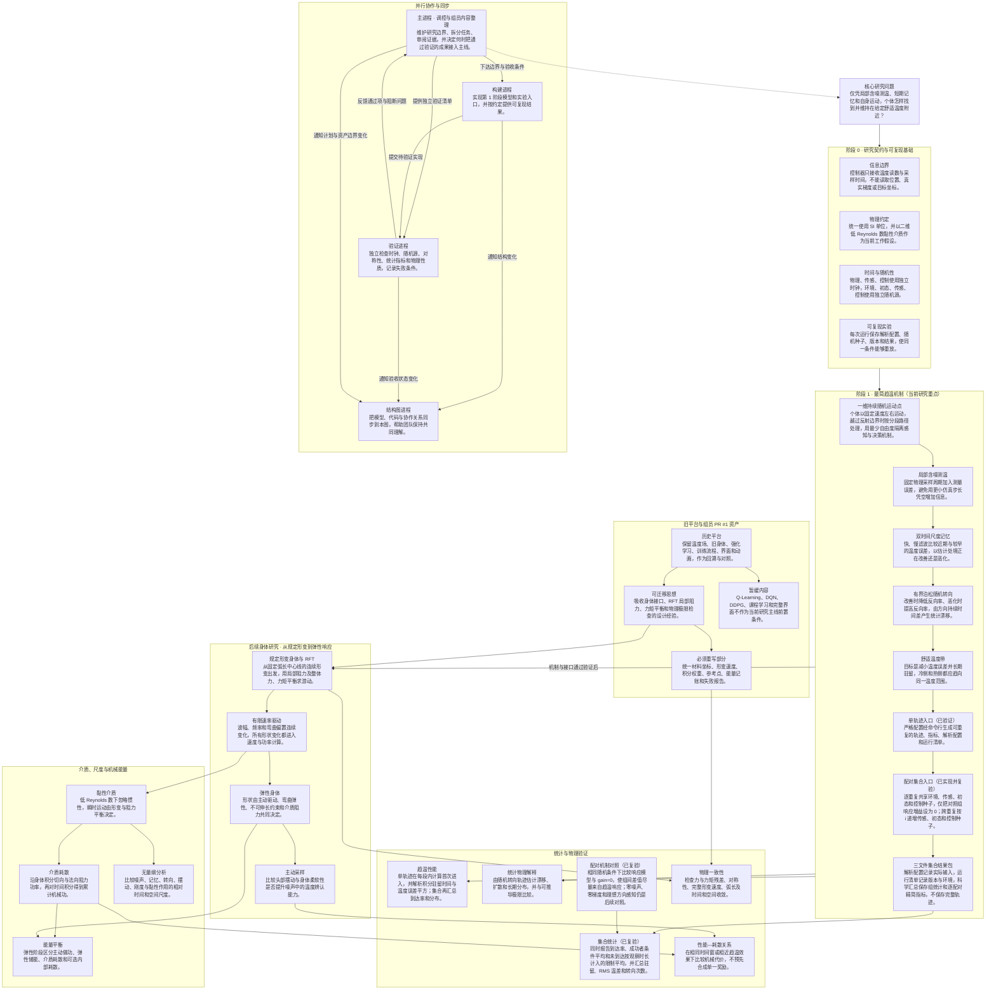

# 软体线虫趋温项目结构图

> 更新时间：2026-09-28  
> 用途：展示研究主线、各阶段关系与当前并行协作方式；代码和模型结构变化后同步更新。

## 当前阶段与汇合条件

- **当前基线**：PR #1 已合并；阶段 0 已建立模型契约、局部传感边界、独立时钟、随机源和结果记录。
- **阶段 0 已复验**：实验时长与时钟周期对齐，配置拒绝未知字段与非整数的整数参数；这些修复已纳入当前 64 项通过的测试集。
- **阶段 1 单轨迹链路已复验**：严格配置、线性场、局部含噪读数、双时间尺度误差记忆、有界泊松反向率、一维持续随机运动、分段反射及段内指标积分已通过；控制器没有位置、真实梯度或温度场访问权限，命令行重复结果包一致。
- **配对集合已实现并独立复验**：`phase1-ensemble` 的响应组和 `gain=0` 对照逐重复共享环境、传感、初态和控制种子；跨重复时传感、初态和控制种子按 `基值+i` 递增，当前确定性温度场的环境种子保持不变。全套测试为 `64 passed`，API 与 CLI 都拒绝非正整数重复数。
- **配对统计原理**：共享随机条件可以减少初态、测量噪声和随机转向造成的组间波动。条件平均首次到达时间只统计已到达轨迹；限制平均使用 `min(首次到达时间, 观察时长)`，使未到达轨迹仍以完整观察时长进入统计。当前还没有置信区间、生存分析或预设样本量，因此集合结果用于机制诊断，尚不是正式参数扫描结论。
- **三文件集合结果包**：输出目录只包含 `config.resolved.json`、`manifest.json` 和 `summary.json`。科学汇总保留两组汇总量、逐配对种子和精简指标，不保存完整轨迹；相同配置与重复数的 `summary.json` 可复现，运行清单中的创建时间随批次变化。
- **独立方向诊断**：40 对重复中，响应组与零响应组的到达率分别为 `1.000` 和 `0.325`，限制平均首次到达时间为 `70.98 s` 和 `163.87 s`，平均驻留比例为 `0.5235` 和 `0.0490`，平均 RMS 温差为 `0.5739 K` 和 `1.0666 K`。这些结果支持当前实现沿预期方向工作，不能替代后续正式统计推断。
- **身体线的起点**：组员 PR 的 RFT 仍只作为历史基线、方程和测试思路来源；相位与形变速度、漏算改形耗散、能量终止、噪声观测和冻结评估等问题尚未修复，不能当作新核心可用模块。
- **两条研究线的汇合条件**：点模型的感知—记忆—转向机制通过独立统计验证，RFT 的运动学、力矩平衡、耗散与数值收敛通过独立物理验证。
- **最终研究关系**：先解释局部含噪信息怎样产生趋温，再研究身体形变和柔软性怎样改变信息获取、运动效果与机械代价。
