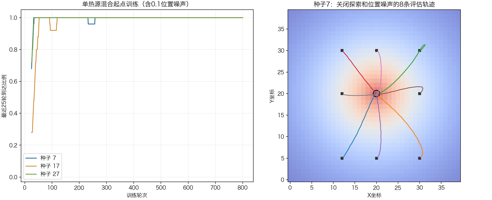
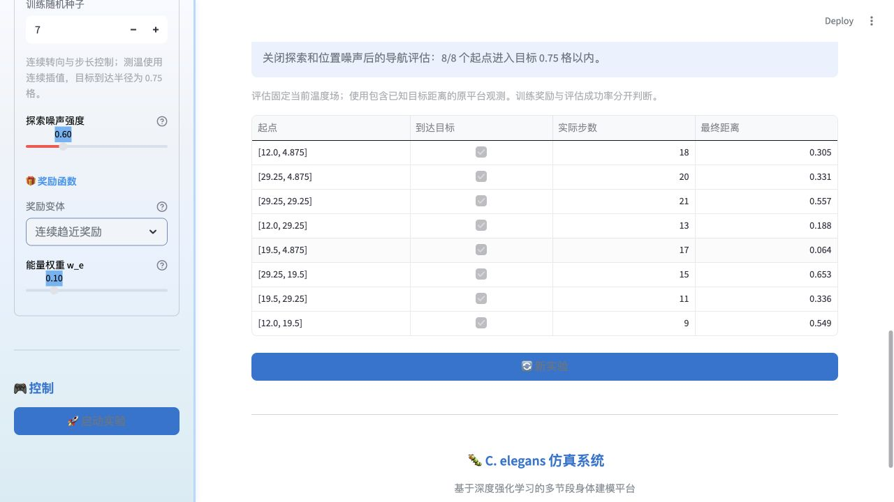
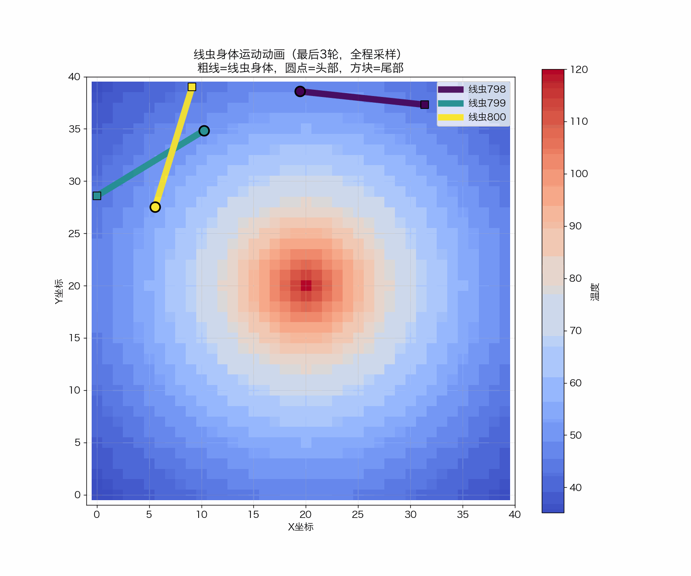

# 原平台 CCB 连续导航优化与验证

日期：2026年10月8日。本报告针对 `程序/` 中的几何中心线模型与 DDPG，不涉及 `src/thermotaxis` 的 SI 身体趋温结论。

## 结果与适用范围

在40×40单热源场中，以头部距离中心不超过0.75格为成功条件，采用界面默认的800轮、每轮最多500步、128隐藏单元、0.1位置噪声，随机种子7、17、27各训练一次。训练后关闭探索与位置噪声，每个策略从8个固定起点评估：**24/24次到达目标**，用时9—25个决策步，中位数16步，最终距离约0.038—0.731格。

这证明本批次的原平台单热源导航可以完成。目标容差为0.75格，不等同于数学上的精确到达一个点。评估使用同一个温度场，初始朝向固定为0；未验证跨地图、局部含噪测温条件下的导航泛化。原平台观测仍包含已知最佳点的距离等额外信息，因此属于 privileged 信息基线。



图中训练曲线为最近25轮到达比例；右图是种子7的8条冻结策略轨迹。方块是经过全身边界调整后的实际起点，黑圈半径0.75格。

## 修改内容与机制

1. **连续测温与观测。**新增双线性插值接口，整数格点保持原数组温度，亚格点位移产生连续温度变化。CCB Actor-Critic 的温度、四方向差分、趋势和身体测温共用连续采样。旧 `get_temperature` 和离散观测保持原行为。双线性场连续，但格点边界的一阶导数可能不连续。
2. **连续奖励。**新增 `continuous` 和 `continuous_energy`。归一化温度作为势函数，奖励为每步代价−0.05、势函数差分与终点奖励的组合；终止状态势函数置零。原版阶梯奖励仍可选择。势函数塑形使用策略的同一折扣因子：

   \[
   r=-0.05+5[\gamma\Phi(s')-\Phi(s)]+10\,\mathbf1_{\mathrm{goal}}-\text{附加惩罚}.\tag{1}
   \]

   目标达成或能量耗尽时终止；步数上限作为截断，仍可 bootstrap。当前目标定义是到达已知热源中心，并非舒适温度区任务。
3. **身体几何约束。**从头向尾重建，节段长度设为目标长度，相邻段转角明确裁限；移除交替软修正造成的长度缩短和尖角残留。边界整体平移，不逐点截断；无法容纳的姿态拒绝更新。它是几何运动模型，不计算弹性力、接触力、自碰撞或完整材料力学。旧长度/曲率 stiffness 配置字段仅保留兼容，界面取消无实际作用的滑块。
4. **连续转向与状态。**CCB Actor输出相对转角和0—前进速度范围内的步长，转角范围由最大转向角决定；避免绝对角的±π接缝。实际朝向每步遵守最大转向角。AC输入增加速度两维，共14维；CCB DQN仍为12维、四帧堆叠。ADB动作仍为波幅、频率、曲率偏置。
5. **DDPG动作与探索。**移除会突破物理范围的可学习 action_scales，在线网络和目标网络均使用有界映射。CCB前1000条经验采用合法范围均匀探索，随后使用按动作范围缩放的OU噪声；评估不写回放、不训练，并恢复训练噪声状态。
6. **训练与统计。**单热源默认每四轮保留一轮默认起点，其余随机位置/初始朝向；可关闭。记录实际步数、平均单步奖励、终点距离、动作及loss。零位移不再自动结束健康的连续控制回合，允许下一步转向离开；成功/耗能终止写入回放。修复AC一步被计数两次及温度重复记录。
7. **可复查输出。**保存 `ddpg_checkpoint.pt`、`continuous_training.json`、`policy_evaluation.json`；界面展示冻结评估成功数、步数和距离。静态动画均匀采样完整历史并保留末帧，避免只显示前150步。初始化、训练或数据导出异常不再伪装为实验成功。

## 检验什么、为什么及结果

| 检验 | 为什么 | 结果 |
|---|---|---|
| 仿射温度场解析值、亚格点变化与格点边界连续性 | 检查插值，而非只看画面渐变 | 通过；原取整读取保留 |
| 2000步随机转向/步长/边界行为 | 复现小步长与急转向导致的身体约束失效 | 最大节段长度误差约4.66×10⁻¹⁵，最大转角约45° |
| 5、9、20采样点的独立段长与夹角复算 | 避免只复用模型的指标函数验证自己 | 通过 |
| 跨±π相对转向、速度观测、终止回放 | 检查动作含义、惯性信息与目标Q计算 | 通过 |
| 评估前后权重、回放、噪声与训练身体 | 防止“评估时继续学习” | 保持不变 |
| 零位移引擎回合 | 允许碰边后改方向，避免未标记终止就重置 | 完整执行设定步数 |
| 界面默认规模的三种子单热源训练 | 检查实际学出的策略能否到达中心 | 24/24冻结评估成功 |
| 实际结果导出 | 检查可视化链路、权重和JSON，而非只有单元测试 | 日志、图、GIF、权重、训练记录和8起点评估均生成 |

完整回归共143项通过，命令见下节。旧matplotlib/pyparsing弃用警告不影响本次结果。

重启Streamlit后，通过浏览器实际运行默认800轮/500步的种子7单热源实验：完整生成上述7类结果文件，界面显示8/8起点评估成功。界面评估起点按场地尺寸比例设置，与命令行的整数起点略有差异，实际用时9—21步。[界面验收数据](assets/ccb-continuous-2026-10-08/platform-validation.json)保存各起点距离、步数和文件校验。



### 训练动画归档

新版界面验收实验 `20261008_040017_exp_1008_035918` 的训练动画已归档到本报告素材文件夹：CCB 连续方向 DDPG、单热源、800轮训练，动画展示最后3轮身体运动。该动画为训练回放；上述冻结策略评估另见评估数据和轨迹图。文件与原始输出的 SHA-256 一致，并已加入本文件夹的 `manifest.json`。



[打开或下载训练动画](assets/ccb-continuous-2026-10-08/training_animation.gif)

## 保留的失败结果与因果判断

- 只使用固定起点、150轮、每轮300步的初步测试中，三个种子的8起点评估分别为4/8、8/8、3/8。它说明只学默认路线并不能保证其他位置的导航。
- 混合起点、250轮、每轮300步、连续插值时，结果为6/8、8/8、8/8，保留了种子7的两个失败轨迹；增大到界面默认800轮/500步的后续批次为24/24。
- **测温取整消融**：保持其他优化，只将测温改回取整，250轮/300步也得到24/24。因此不能认定温度不连续是此前失败的主要原因，也不能声称插值提高了本批次最终成功率。各实验使用相同种子编号，但策略轨迹与终止时间会影响后续随机数消耗和实际训练步数，结果不是严格等轨迹/等计算量因果比较。
- 本次同时修改奖励、身体约束、转向表示、惯性观测、探索、回合处理与起点分布，没有分别识别各项贡献。改善应归于这组修改在上述任务上的共同效果。

## 如何复现

依赖使用仓库 `requirements.txt`，CPU网络设为单线程。运行：

```bash
PYTHONPATH=src python3 -m pytest tests 程序/test_core.py -q
python3 analysis/validate_ccb_continuous.py --seeds 7 17 27 --rounds 800 --steps 500 --hidden 128 --noise 0.1 --start-mode mixed --output results/ccb-continuous-2026-10-08/ui-defaults.json
python3 analysis/validate_ccb_continuous.py --seeds 7 17 27 --rounds 250 --steps 300 --hidden 128 --noise 0.1 --start-mode mixed --sampling grid --output results/ccb-continuous-2026-10-08/grid-ablation.json
```

界面中选择“连续中心线 → 连续方向（Actor-Critic）→ 单热源”，奖励选择“连续趋近奖励”，折扣0.99，启用混合起点、随机种子7，其余使用默认值。修改Python模块后应完整重启Streamlit，避免旧服务缓存不同版本的依赖。

[汇总数据](assets/ccb-continuous-2026-10-08/validation-summary.json)保留每轮结果、初始/最终评估及轨迹；[字节校验](assets/ccb-continuous-2026-10-08/manifest.json)对应归档图和JSON。未提交大体积回放与权重；脚本会在本地 `results/` 生成。此前旧 action_scales 或12维绝对朝向权重与新CCB不兼容，应重新训练。
