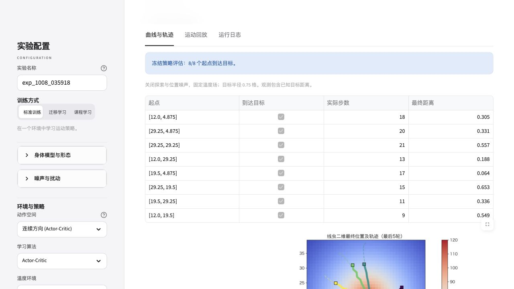

# 原平台界面改版

本次修改 `程序/app.py` 的呈现与交互，保留原训练引擎、身体模型、策略与参数的含义。以 Apple 官网的简洁视觉层级为参考：白色与浅灰底、深色系统字体、细分隔线，蓝色仅用于主要操作。

## 界面变化

- 首页展示当前身体模型、学习算法与温度环境；身体示意随模型切换，并明确标为非训练轨迹。
- 三种训练方式使用紧凑分段选择，身体、扰动与训练参数分组收起；选项显示简短名称，内部值和配置解析保持兼容。
- 按钮、焦点、折叠项及标签采用轻量过渡；支持系统的减少动态效果偏好，无外部字体或动画依赖。
- 实验名称在普通参数切换后保留；一次点击触发训练，运行时锁定参数并显示停止操作。
- 完成后保存结果包路径，再重新呈现界面、恢复参数操作；普通重运行不会再次训练，切换配置后保留最近一次结果。
- 结果按曲线与轨迹、运动回放和日志分开展示。首页、进行中与完成状态共用统一视觉样式。

## 检验与范围

使用当前环境 Streamlit 1.50.0。真实 AppTest 重运行验证了一次点击只执行一次引擎、完成后恢复状态、改配置时保留实验名称和结果、三个模式及连续控制选项的内部值。完整回归命令 `PYTHONPATH=src python3 -m pytest tests 程序/test_core.py -q`，146项通过；14条既有 matplotlib/pyparsing 弃用警告。

浏览器实际运行默认CCB单热源实验：800轮训练完成，8/8冻结评估成功，7类结果文件已验证。训练结束后参数自动解锁；切换详细分析后实验名称和既有评估仍保留，动画与日志标签均显示实际输出。最终版另外实际验证了停止训练：一次停止恢复参数操作，显示停止反馈，并保留上一份完整结果。

[浏览器验收数据](assets/platform-ui-2026-10-08/browser-validation.json)记录结果包校验；下图为训练完成后的界面。

本次新版界面验收产生的[训练动画](assets/ccb-continuous-2026-10-08/training_animation.gif)已归档到 CCB 连续导航报告素材文件夹，展示800轮训练中最后3轮的身体运动；与验收数据记录的原始 GIF 字节校验一致。

窄屏样式已设置，实际浏览器视觉验收使用桌面视口；未进行移动端浏览器的实际运行验证。

参考：[Apple 官网](https://www.apple.com.cn/)、[Streamlit App testing](https://docs.streamlit.io/develop/api-reference/app-testing)。
