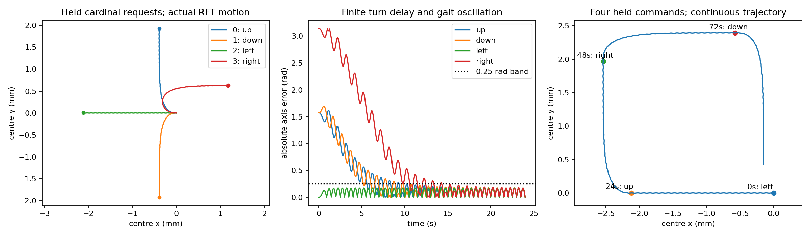

# 阶段进展：身体物理基准与既有四方向策略衔接

实验批次：2026年10月4日；报告更新：2026年10月5日。接续 [点模型与长时基准汇报](progress-2026-10-04-closure.md)。本轮完成第二阶段的身体物理基准，并继续接入既有四方向动作与冻结策略。尚未完成仅局部测温的身体趋温实验或弹性模型。

## 完成内容

建立了一条固定材料弧长的二维身体。身体由切角行波重建，长度不会随摆动改变；幅值、相位和弯曲偏置的时间变化均计入完整局部速度。身体中心采用均匀材料弧长平均，全局平移和旋转与内部形变分开。

游动速度由局部切向、法向阻力及整体合力、合力矩为零求出，不预先设定前进速度。根据实际材料速度积分瞬时介质耗散，再随时间累加。完整几何导数与机械平衡已经通过独立验证，新增病态矩阵检测会明确报错。

左图为固定行波，右图为连续调制驱动；各色对应不同时刻，圆点标示同一材料端点，坐标单位为毫米。

方法采用局部RFT近似，依据见 [Lauga与Powers的综述](https://arxiv.org/abs/0812.2887)。该近似忽略身体不同位置间的非局部流体耦合。本轮阻力绝对值是SI工作参数，未做介质与身体半径标定；耗散数值用于检查模型和缩放，不作为实际生物能耗。

## 实际基准结果

参考身体长1mm，切角幅值0.6rad，一条材料行波，频率1Hz，法向/切向阻力比2。运行4秒所得结果：

| 指标 | 固定行波 | 幅值、相位及偏置调制 |
|---|---:|---:|
| 净位移 | 0.37914mm | 0.37775mm |
| 横向净位移 | 约0 | 0.01439mm |
| 净旋转 | 约0 | −0.03227rad |
| 介质累计耗散 | 0.84138pJ | 0.85545pJ |

固定行波净平均速度约0.09478mm/s，沿当前行波传播的反方向推进。它与点模型给定的0.2mm/s不同；后续比较身体和点模型时，需要明确速度及信息采样尺度，不能把差异全部归于身体形状。

本轮另完成16组幅值/阻力比扫描、12组时间与空间积分收敛比较。默认0.01秒与0.005秒时间步下，调制轨迹终点x差约2.81nm、y差约0.93nm。参考轨迹有限节点与时刻上的最大局部速度约0.7685mm/s；以既有密度和黏度工作值估算Re约0.0077，作为低惯性量级筛查。

## 验证结果

身体基准批次完整测试 **102项通过**，其中新增16项身体机械测试。独立验证采用12,001个材料点和梯形积分，重新构造几何、速度和阻力矩阵，没有复用核心的Gauss积分和矩阵装配；与新实现的平移速度差约1.35×10⁻¹²m/s，功率相对差约3.16×10⁻⁸。

通过的物理检查包括：完整参数变化的几何有限差分、材料长度和中心规范、合力/合力矩平衡、耗散与形变功一致性、镜像和旋转协变、阻力整体缩放、各向同性零中心平移、单形状参数往复周期零净姿态，以及时间和空间收敛。各向同性和往复运动仍可消耗机械能，零净推进不等于零耗散。传播频率为零而幅值仍变化时，也得到正耗散。

## 既有四方向训练与身体执行的衔接

组员已经实现身体模型、四方向离散训练与演示界面。本轮沿用这些资产：保留动作编号、旧训练程序和 Demo，提供 Q 表及 DQN 冻结推理接口。新增身体模块的目的，是统一材料坐标和完整形变速度，使转向、位移与耗散可以在同一物理模型中核算；已有四方向策略因而能够成为身体研究中的迁移对照。

四个动作仍是“0上、1下、2左、3右”。旧屏幕坐标 y 向下，新实验室坐标 y 向上，接入时明确翻转坐标。命令先改变幅值、频率和弯曲偏置的目标，三个驱动状态以0.5秒时间常数响应，再由力与力矩平衡求实际平移和转动。相位由瞬时频率积分，所有驱动变化率均计入局部速度和介质耗散。

身体头部取同一个材料端点，位置由实际位形算出。物理、传感、控制周期分别为0.02、0.1和0.2秒。局部测温接口只提供读数、采样时刻、当前时刻与上一动作；旧 Q 表依赖绝对网格位置，单独标为额外信息模式。低层方向执行器使用自身姿态反馈，热导航策略没有获得整个温度场。

从同一初态、前向轴向左、驱动静止出发，各方向保持24秒：

| 命令 | 中心净位移 x/y（mm） | 方向误差首次连续1秒≤0.25rad | 介质耗散（pJ） |
|---|---:|---:|---:|
| 上 | −0.392 / +1.927 | 9.34秒 | 4.665 |
| 下 | −0.392 / −1.920 | 9.80秒 | 4.678 |
| 左 | −2.117 / +0.002 | 0秒 | 4.511 |
| 右 | +1.174 / +0.626 | 14.32秒 | 4.976 |

净位移包含转弯过程。末4秒平均绝对轴误差约0.11rad，行波仍会使朝向周期摆动。把物理步长从0.02秒加密到0.01秒，四条轨迹终点位置差约115—127nm，耗散相对差均小于0.006%。另完成96秒左→上→右→下连续指令、未启动静止和启动后渐停检查。

这一结果揭示了策略迁移的时间尺度：90°转向约需9—10秒，180°转向约需14秒，远长于0.2秒的指令周期。旧网格训练中的立即换向，在身体模型中变为连续弯曲与有限时间的转向；同样的动作序列可能产生不同的路径和耗散。转向时间不能直接用执行器0.5秒响应常数代替，它还取决于形变产生的旋转速度。

## 训练成果的可用范围

已检查项目（包括忽略文件）和旧默认保存目录，暂未找到历史 Q 表或网络权重。冻结加载接口支持旧保存格式；旧 `.npy` 文件实际为中文制表文本，Q值只有三位小数，读取后复现的是导出表策略，舍入可能改变并列动作。

为实际验证接口，用未改动的旧 Worm2D 新训练了一份固定种子样本：17×17网格，60轮×120步，共7,200次更新。全部289个格点的冻结动作都属于原表最大Q的动作集合，评估过程没有修改权重。DQN接口则用真实旧 simple/dueling 架构的合成测试权重检查严格加载及推理一致性。这些记录是新接口样本及测试，未复现组员历史训练质量。

旧样本的任务趋向20—120温度场的最高温热峰；新研究任务趋向给定舒适温度。旧 Q 表使用绝对位置，旧 DQN还使用邻点温差、梯度关系和最佳点距离。因此本轮迁移只能验证动作与物理执行之间的联系，不能作为局部含噪趋温效果或训练改进的结论。

实际冻结 Q 表接入采用17×17网格到4mm×4mm区域的显式映射，原样本保持不变，预定运行96秒。从身体中心(1mm,2mm)、前向轴向左开始，执行44次指令后，头部在8.70秒的物理采样节点首次离开区域，终点头部坐标约(−0.00503mm,1.44298mm)，累计介质耗散1.7943pJ。程序保留越界位置并终止，不裁剪坐标、不再请求越界查表；这次运行没有完成导航。此结论只针对该新样本、映射和初态。

蓝线为材料头部实际轨迹，橙叉为首次采样离域点，绿星是旧任务的热峰位置。映射网格间距0.25mm是本次实验约定，未标定为旧程序原有物理尺度。策略虽然能够驱动身体，网格中的立即换向效果没有自然迁移到连续身体，后续需要统一边界与任务后重新评价。

## 本轮新增验证

最终完整测试 **115项通过**（33.24秒，14项既有绘图依赖弃用警告），比身体基准批次新增13项。覆盖四方向与坐标映射、冻结Q表和真实旧网络架构、信息权限、有限驱动解析响应与相位积分、命令处形状连续、独立时钟、真实头部和功率记录、渐停及离域终止。

主进程另从保存轨迹独立复算四方向的位移、转向判据和耗散，完整重演24秒向左基准与8.70秒冻结Q表轨迹，逐项一致；策略表的前后散列一致，实验清单的全部源文件散列与当前文件一致。24份桥接原始记录、配置、清单及图表已复制进报告证据目录并逐文件核对内容；两套新增图已查看。记录见[桥接独立验证](../validation/phase2-bridge-validation-2026-10-04.md)。

## 当前范围与下一步

有限响应执行器、真实材料头部坐标、独立感知/控制时钟和冻结策略读取已经实现。局部温度采样入口支持外部注入含噪读数，身体上的双记忆趋温实验尚未开展。墙面接触、自交处理、弹性本构及绝对阻力标定仍待完成。

下一步按如下顺序开展：

1. 在给定线性温度场与舒适带中接入既有局部记忆机制，记录冷热两侧的温度误差、首次到达、驻留与耗散，设置无响应对照。
2. 以本轮实测转向时间为依据，比较动作保持时间和转向时间的比例，识别快速重发命令的无效或冲突区间。
3. 若获得组员历史权重，先做同任务冻结复演；正式策略比较统一温度目标、信息条件、物理观察时间和边界处理，随后再考虑重新训练。

## 一分钟口述

我们在组员原有身体模型和四方向训练基础上，完成了统一材料坐标、完整形变速度及耗散核算，并把四方向命令接入有限响应身体。身体的位移和转向由物理平衡产生。当前参数下，90度转向约需9到10秒，180度约需14秒，这解释了旧离散动作迁移后路径可能变化。冻结策略接口已完成；本轮用旧程序新训练的样本核验接入，历史权重尚未找到。该样本实际接入后于8.70秒头部离域，说明接口可运行，迁移导航仍有问题。完整测试115项通过。下一步在统一舒适温度任务中连接局部记忆机制，比较趋温表现与耗散，并研究控制时间尺度。

材料：[身体推导](../phase2-prescribed-body.md)、[动作与驱动方法](../phase2-four-action-bridge.md)、[旧策略与训练样本](../legacy-policy-bridge.md)、[身体独立验证](../validation/phase2-body-validation-2026-10-04.md)、[桥接独立验证](../validation/phase2-bridge-validation-2026-10-04.md)、[中文结构图](../project-structure-map.md)。新证据归档于 `assets/phase2-four-action-2026-10-04/` 和 `assets/legacy-policy-bridge-2026-10-04/`。改动保存在本地，尚未提交或推送；旧演示界面保留。
