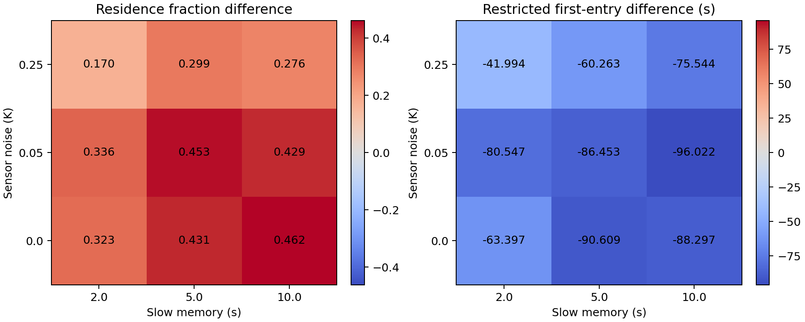

# 含噪局部感知下的软体个体趋温：阶段进展汇报

汇报日期：2026 年 10 月 4 日。性质：物理学本科科研项目的阶段汇报。

## 当前进展与研究判断

目前已经建立了独立、可复现的一维趋温机制模型，完成局部感知权限、时钟、随机源、边界处理和评价指标的实现验证。本轮进一步开展固定设计的噪声—记忆探索性扫描，并用另一组随机种子检验参考参数在冷热两侧的表现。

现阶段成果回答的是：在给定舒适温度的静态梯度中，仅通过局部含噪测温和短期记忆，是否可以形成朝舒适区的统计运动偏置。后续要研究身体形变、柔软性怎样改变这一过程，以及相应的机械耗散。

## 研究问题与物理思路

舒适温度 T* 由外部给定。个体不知道自身位置、真实温度梯度和舒适区坐标，只接收当前位置的带噪温度与采样时间。任务包括寻找舒适温度带，以及在有限观察时间内维持较高的驻留比例。

研究从自由度较少的模型逐步推进：一维持续随机运动 → 规定形变的自由游动身体 → 有弯曲弹性的身体。点模型先隔离信息与决策机制；身体阶段再加入阻力平衡和能量记账。统计物理方法用于连接随机轨迹、漂移、扩散和分布；尺度分析用于解释噪声、记忆与运动时间尺度之间的配合。

## 已完成工作及组员贡献

| 工作板块 | 当前完成情况 | 对研究的作用 |
|---|---|---|
| 组员平台 | PR #1 已作为历史平台基线合并；保留身体选择、强化学习、训练界面、图表和动画 | 提供演示与身体接口、RFT 阻力平衡和物理检查的设计经验 |
| 第 0 阶段 | 统一 SI 单位，严格配置，独立物理/传感/控制时钟与随机源，保存配置、版本和结果 | 实验定义可审计，同条件可重放 |
| 第 1 阶段机制 | 一维固定速度点、局部高斯测量误差、快慢记忆、有界随机反向、反射边界 | 用少量自由度检验趋温机制 |
| 指标与数值验证 | 沿真实路径计算首次进入、驻留时间和温度误差平方；验证镜像、时钟及步长一致性 | 避免漏掉跨带事件和把更多物理步误当更多信息 |
| 机制对照 | 响应组与响应增益为零的对照组共享每对随机条件 | 将性能差异关联到指定控制机制 |
| 本轮统计推进 | 探索参数扫描、新种子参考实验、置信区间和首次进入生存曲线 | 将单轨迹展示推进到可量化的群体结果 |

旧演示界面继续保留，视觉优化安排在后续。新机制当前采用规则控制器，没有神经网络训练过程。旧强化学习的奖励与观测任务和本轮舒适温度任务不同，训练曲线需要按各自任务解释。

## 模型与实验设计

温度场为静态线性梯度，区域长 30 mm，梯度 100 K/m；舒适温度 293.15 K，舒适带半宽 0.25 K，其位置区间为 12.5—17.5 mm。个体速率为 0.2 mm/s，冷侧初态 3 mm，热侧初态 27 mm。每条轨迹观察 180 s；测温周期 0.1 s，控制周期 0.2 s。

控制器把测得温度与 T* 的绝对误差送入快、慢两个指数记忆。快记忆误差小于慢记忆时，近期环境正在改善，降低反向率；恶化时增加反向率。参考快、慢记忆时间为 0.5 s 和 5 s，基础反向率 0.1 s⁻¹，允许范围 0.01—0.5 s⁻¹。改善判断只使用带噪测量，评价指标使用真值温度。

本轮在运行前保存固定设计。探索扫描为 3 个噪声水平（0、0.05、0.25 K）×3 个慢记忆时间（2、5、10 s），每格 32 对，只用于定位参数影响。参考参数另做冷、热起点各 128 对，采用与旧诊断、探索扫描不同的种子块；固定样本量不随观察结果追加。它是模型内的参考条件确认实验，尚未完成以置信区间精度为停止条件的大样本研究。

| 指标 | 定义与解释 |
|---|---|
| 到达率 | 180 s 内至少一次进入舒适带的轨迹数/总轨迹数；报告 Wilson 95% 区间 |
| 限制平均首次进入时间 | 每条未到达轨迹按 180 s 计入，所有轨迹一起平均；对应首次进入生存曲线在 0—180 s 的面积 |
| 驻留比例 | 每条轨迹在舒适带内的真实运动时间/180 s，然后对轨迹平均 |
| RMS 温度误差 | 每条轨迹将真实温度偏离 T* 的平方按时间积分、平均、开方，再对轨迹平均 |
| 配对差及区间 | 每对响应指标减去对照指标，以整对为单位 bootstrap 重采样；不把轨迹帧作为独立样本 |

## 本轮结果

本轮完成 9 格×32 对探索扫描和冷、热各 128 对参考实验，共 544 对、1,088 条轨迹。下表到达率括号为 Wilson 95% 区间，其他列为全体轨迹的均值。

| 起点与组别 | 到达率（95% 区间） | 限制平均首次进入 / s | 驻留比例 | RMS 温差 / K |
|---|---:|---:|---:|---:|
| 冷侧，响应 | 98.4%（94.5%—99.6%） | 68.85 | 0.5237 | 0.5629 |
| 冷侧，无响应 | 26.6%（19.7%—34.8%） | 163.16 | 0.0579 | 1.0372 |
| 热侧，响应 | 100.0%（97.1%—100.0%） | 68.41 | 0.5257 | 0.5571 |
| 热侧，无响应 | 25.0%（18.3%—33.2%） | 163.43 | 0.0463 | 1.0467 |

使用整对重采样计算的配对差（响应减无响应）如下；括号为 4,000 次 bootstrap 的百分位 95% 区间。时间差为负、驻留差为正、RMS 差为负，分别表示寻找更快、驻留更多和温度误差更小。

| 起点 | 限制首次进入时间差 / s | 驻留比例差 | RMS 温差差 / K |
|---|---:|---:|---:|
| 冷侧 | -94.31（-101.20—-87.41） | +0.4658（+0.4341—+0.4973） | -0.4743（-0.5173—-0.4323） |
| 热侧 | -95.02（-101.87—-87.30） | +0.4794（+0.4470—+0.5097） | -0.4896（-0.5297—-0.4471） |

参考参数的冷热两侧都出现一致方向的改善，上述三项配对区间均未跨零。可以报告“在当前模型和给定参数下，趋势记忆控制提高了有限时窗趋温表现”。这还不解释身体柔软性，也不证明跨环境的普适性。

图 1：纵轴为尚未首次进入舒适带的轨迹比例，下降更快表示进入更早。每侧 128 对，180 s 行政删失；实线为响应、虚线为无响应。Cold/Hot 表示冷/热侧。

图 2：每格 32 对；左为驻留比例差，右为限制首次进入时间差，均为响应减无响应。本次九格驻留改善范围为 +0.1701—+0.4624，限制首次进入时间缩短约 41.99—96.02 s。高噪声 0.25 K 的改善幅度在本次扫描中较弱。该扫描用于提出后续问题，不进行参数最优性或多重比较显著性声明。

数值加速前已比较物理步长 0.01 s 与 0.1 s，保留测温和控制周期。构建检查四组噪声/记忆极端条件，独立验证另查八组冷热/噪声/种子配置；结果在误差阈值内一致。加速降低了分段匀速运动的重复计算次数，没有改变传感或控制信息量。

## 结果的适用范围与验收

这里的驻留比例和首次进入统计都是 180 s 有限时窗结果，尚不能称为稳态分布。结果依赖当前线性梯度、独立高斯测量误差、速度、边界和控制参数；探索扫描没有做多重比较校正，不能据最高格点宣布最优参数。冷热两侧的有限样本差异需要结合各自区间解释，不能因均值接近就宣称统计等价。

控制器可能触及反向率上下限，随后须统计其饱和比例，再决定哪些参数能与弱响应推导比较。点模型没有形变、弹性储能和机械功；配置中的介质与参考 Reynolds 数只服务后续尺度约定，当前点模型未求解流体或身体力学。

组员的 RFT 思路可迁移，但正式能耗实现仍需统一几何时间导数、弧长积分权重和累计功；不能以剩余能量预算代替真实累计耗散。

本轮独立验收已完成：全部 544 对指标和 1,088 行 CSV 独立复算，11 个实验条件的首对另行重跑，原始记录与汇总一致；设计、分析脚本和核心源代码哈希匹配。完整回归为 67 项通过（已有 64 项加 3 项统计契约检查）。核心版本为 `fd7add1`；本轮新增统计脚本、设计和报告在本地工作区，尚未提交或推送。

HTML 汇报页已通过规范、完整载荷和离线结构检查。当前报告打包工具未找到可用 Chromium，未进行浏览器布局及交互验收；静态科研图已逐张检查。Markdown 正文作为可编辑讲稿，关键图表和统计证据已单独归档。

## 下一步安排与完成标准

| 顺序 | 工作内容 | 可向老师提交的成果 | 完成标准 |
|---|---|---|---|
| 1：完成第 1 阶段解释 | 统计饱和比例；做无响应解析基准和弱响应近似；估计漂移、扩散；补控制周期、边界与时窗敏感性 | 推导说明、理论—数值比较图、机制有效区间 | 说明近似成立条件；至少一个可处理极限与仿真一致；不预设位置过程闭合 |
| 2：建立身体力学 | 按固定材料弧长重建中心线；用完整形变速度求局部阻力与整体力/力矩平衡；记录功率和累计功 | 固定驱动游动、转弯及数值验证图 | 力/力矩残差、几何有限差分速度、对称性、弧长与步长/网格收敛通过 |
| 3：接入趋温控制 | 用连续有限速率的驱动完成行为转向，接入同等局部感知 | 身体版趋温和性能—耗散比较 | 同时保存命令、有效驱动、观测、轨迹及机械功；统一观察窗和成功率 |
| 4：正式研究柔软性 | 加入弯曲弹性；先固定驱动比较刚度，再另做各刚度重新调参 | 一个身体参数对含噪趋温与耗散的因果比较 | 关驱动弛豫、储能—主动做功—耗散平衡及数值收敛通过 |

下一轮优先完成第 1 项，并确定第 2 项的身体、驱动和机械能接口。第 1 阶段的统计分析与身体力学准备可以并行；身体版趋温须等待力学验收。时间安排按可验证交付物推进，正式大规模扫描前先测代表配置运行成本。

## 希望与老师讨论的问题

1. 主课题是否聚焦“噪声下的主动采样与身体柔软性”，把点模型作为机制基准与阶段成果？
2. 身体介质选择先按低 Reynolds 数黏性介质自由游动推进，还是需要对接培养皿表面爬行？这会影响阻力、接触和功率定义。
3. 本科项目的优先交付是否设为“一个可解释机制＋一个身体因素的性能—机械代价比较”，再视进度增加温度场复杂性？

## 汇报口述稿

我们研究的是个体在只能局部含噪测温的条件下，怎样找到并维持在给定的舒适温度附近。现阶段已经完成可复现的一维机制模型，用快慢记忆判断近期温度误差是否改善，再改变随机转向的持续时间。组员原有的身体接口、训练平台和演示功能已经保留。本轮共完成 544 对实验；参考参数下冷热两侧的响应到达率约为 98% 和 100%，无响应对照约为 27% 和 25%，限制平均首次进入时间缩短约 94—95 秒，配对区间支持这个改善方向。结果属于当前模型、180 秒时窗；下一步先完成理论解释和敏感性检验，然后接入经过力学验证的形变身体，研究柔软性怎样改变趋温效果与机械耗散。

## 复现材料

- 模型说明：`docs/phase1-point-model.md`。
- 固定实验设计：`configs/phase1_progress_scan.json`。
- 实验与统计脚本：`analysis/phase1_progress_scan.py`。
- 本轮原始配对指标、配置、汇总、图和运行清单：`results/phase1-progress-2026-10-04/`。
- 独立验收：`docs/validation/phase1-progress-validation-2026-10-04.md`。
- 简体中文结构图：`docs/project-structure-map.md`。

完整结果目录属于本地实验产物，默认由 Git 忽略；汇报保留关键汇总、图和设计，完整配对数据需在交接实验时一并归档。
