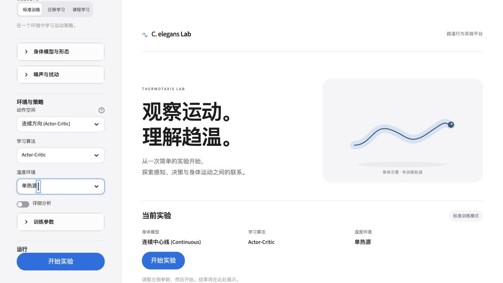

# 软体仿生线虫项目阶段进展汇报

更新日期：2026年10月9日。本稿以CCB连续中心线身体与DDPG连续控制为主要内容，训练和评估结果采用2026年10月8日归档；点模型和新力学部分采用10月4日归档。本次调整文稿，没有重新训练或重跑实验。

## 一、本阶段的主要工作

本阶段的主要工作，是在前期多节段身体和离散方向控制平台上，完善连续中心线身体CCB，并使用DDPG学习连续转向和移动幅度。目前已经完成单热源环境中的训练、模型保存和冻结策略评估，也能够在界面中查看运动回放、训练曲线和评估结果。

汇报主要围绕三个问题展开：CCB怎样表示和更新身体，DDPG怎样学习连续动作，以及实际训练出的策略能否从不同位置到达目标。局部感知与记忆实验、新身体力学构建作为后续研究基础简要介绍。

> **讲述补充：**这次我主要介绍连续身体与连续控制的实现，以及已经得到的导航结果。最后再说明局部感知和新力学方面的进展与后续安排。

## 二、CCB：用连续中心线表示身体运动

CCB是ContinuousCenterlineBody，即连续中心线身体。程序用沿身体排列的采样点表示中心线，头部移动后，从头向尾重建身体，保持规定的节段长度，并限制相邻身体段的弯折角。这样可以在连续位置上表示身体形状和运动。

与原来的4方向、8方向动作相比，连续控制允许策略选择范围内的转向角和移动幅度。例如，策略可以给出“小幅左转、短距离前进”，而不必只在几个固定方向中选择。当前CCB每步使用相对转角，实际朝向变化受到最大转向角限制；移动还受速度历史和运动阻尼影响。

本阶段也完善了身体约束与边界处理：身体接近边界时整体调整位置，避免逐点截断造成长度和形状异常。已有随机动作与独立几何检查，用于确认连续运动中的节段长度和弯折限制。

**图1：CCB连续控制的平台入口。**界面可以选择连续中心线身体、连续动作和对应训练参数。首页身体示意用于说明模型，训练后的实际运动见下一节的轨迹与回放。

CCB目前属于几何运动模型：策略决定头部怎样移动，身体按几何约束更新。它还没有计算弹性受力如何决定身体形变，因此现阶段的结果主要用于研究连续动作学习与导航。

> **讲述补充：**CCB解决的是怎样用连续位置和身体形状执行动作。算法能够选择转多少、走多远，身体再按照长度、弯折和边界约束更新。

## 三、DDPG：怎样学习连续转向和移动幅度

DDPG是Deep Deterministic Policy Gradient，属于Actor-Critic方法。它包含两个相互配合的网络：Actor根据当前状态输出连续动作，Critic根据状态和动作估计未来累计奖励。训练中，Critic利用实际经验更新评价，Actor根据Critic的评价调整动作选择。

在当前CCB任务中，这个过程可以按以下顺序理解：

1. **读取状态。**观测包含温度、方向差分、温度变化趋势、身体测温、朝向和速度等信息，当前Actor-Critic输入为14维。
2. **输出动作。**Actor输出相对转角与移动幅度，动作限制在身体允许的范围内。
3. **执行并获得反馈。**身体更新位置与形状，环境根据移动结果给出奖励，再记录新的状态。
4. **利用经验学习。**历史经验存入回放缓冲区，训练时随机抽取；目标网络缓慢更新，用来减小学习目标的快速变化。训练阶段加入探索，评估时关闭探索并停止学习。

为了使小幅连续移动获得可用的反馈，本阶段补充了连续温度采样和连续奖励。温度通过双线性插值读取；奖励结合每步代价、归一化温度势函数的变化和到达目标奖励，使接近目标的过程能够持续获得反馈。

此外，训练采用混合起点：保留部分默认起点，其余轮次随机位置与初始朝向，减少策略只熟悉一条路线的问题。身体约束、动作边界、速度观测、探索和回合终止处理也进行了配套调整。

当前任务的目标是到达已知单热源中心。观测仍包含到已知最佳点的距离等额外信息，因此这是一组具有额外目标信息的导航基线；仅依靠局部含噪测温的身体导航留待后续实验。

> **讲述补充：**DDPG中，Actor负责选动作，Critic负责评价动作。身体每次运动产生经验，两个网络据此逐步改进。这里的重点是让算法能够学习连续转向和移动幅度，并检查学出的策略是否真的能到达目标。

## 四、CCB与DDPG的实际训练和导航结果

最新归档实验使用40×40单热源场，每次训练800轮、每轮最多500个决策步，网络隐藏层为128单元，位置噪声设置为0.1。随机种子7、17、27分别训练一份策略。成功条件是头部距热源中心不超过0.75格。

训练后固定网络权重，关闭探索和位置噪声，每份策略从8个固定起点评估。三份策略合计24次评估，全部到达目标；用时9—25个决策步，中位数16步，最终距离约0.038—0.731格。

**图2：训练过程与学成后的导航结果。**左图横轴是训练轮次，纵轴是最近25轮中到达目标的比例，三条曲线对应三个随机种子；曲线接近1，表示该窗口内大多数或全部训练轮次成功。右图是种子7策略从8个起点出发的冻结评估轨迹，背景表示温度分布，方块为实际起点，中心黑圈为0.75格的目标范围。右图直接展示学出的策略能否从不同位置到达目标。

这两部分分别回答“训练过程中表现怎样变化”和“停止学习后能否完成导航”。三组种子的24/24次成功支持本批次同一单热源场中的导航效果。评估初始朝向固定为0，也没有加入位置噪声，跨温度场与扰动下的表现仍需另外检验。

实际平台还完成了一次默认规模的800轮训练，界面冻结评估为8/8成功，能够保存权重、训练记录、评估数据、图表和运动回放。下面的动画可在讲述时播放，展示训练最后3轮的身体运动；它属于训练回放，与上图冻结评估分别解释。

[播放CCB连续控制训练回放](../docs/reports/assets/ccb-continuous-2026-10-08/training_animation.gif)

早期固定起点、150轮训练时，三个种子的评估结果分别为4/8、8/8和3/8。后续配套调整并增加训练后，得到当前24/24次成功。由于奖励、动作、身体约束和训练起点等同时改变，目前把改善归于整组调整，尚未分别确定每项贡献。已有取整测温对照同样完成24/24次评估，因此不把成功单独归因于插值。

> **讲述补充：**目前最直接的结果是三份独立训练的策略，在同一单热源场的24次冻结评估中全部到达目标。右图展示其中一份策略的8条路线，可以看到它能够从不同位置向中心移动。下一步需要检查换温度场、换初始朝向和加入扰动后的表现。

## 五、其他研究基础：局部记忆与新身体力学

### 局部含噪感知与记忆

另一部分工作研究个体只读取当前位置的含噪温度时，能否借助时间记忆形成趋温行为。为单独研究这一机制，先采用一维点模型，将温度偏差存入快、慢两种记忆，并根据近期误差是改善还是恶化调节反向概率。这部分使用规则控制器，没有强化学习训练。

**图3：局部记忆的趋温对照结果。**左、右图分别从冷侧和热侧出发，每侧128对实验。蓝线开启趋势响应，橙色虚线关闭趋势响应；纵轴是尚未进入过舒适区的轨迹比例，越低表示已经到达的越多。180秒内，冷侧到达率为98.44%对26.56%，热侧为100%对25%。

长时实验中，20、30、60毫米区域的响应组最后600秒驻留率均约82%，无响应组分别约25%、19%和9%。这些结果提供了局部测温与记忆机制的依据，后续将把相同信息条件接到身体上，检验身体转向与控制响应是否改变趋温表现。

### 新身体力学构建

独立力学核心目前已经初步建立：规定身体的行波形变，根据局部切向、法向阻力与整体合力、合力矩平衡，计算实际推进、转动和介质耗散。已有机械基准和数值检查，相关验证与后续接入仍在推进。本次不展开位形、耗散和收敛图，详细记录保留在补充材料。

这一部分与CCB承担不同任务：CCB用于当前连续控制训练与导航；新力学核心用于进一步研究身体形变、介质作用及运动代价。目前还没有新力学身体完成趋温训练的结果，弹性受力决定形状的模型也待继续构建。

> **讲述补充：**局部记忆实验为后续减少目标信息提供机制依据；新力学构建为研究身体形变和运动代价提供基础。这两部分接下来再与身体导航连接。

## 六、下一阶段安排

下一阶段继续围绕CCB与连续控制推进：

1. **补充冻结评估条件。**改变初始朝向，加入位置扰动，使用未参与训练的温度场，记录到达率、决策步数和终点距离。
2. **逐步减少额外目标信息。**先比较保留与去除目标距离信息的表现，再研究仅依靠局部含噪测温和时间记忆的身体趋温。
3. **开展统一条件下的比较。**比较离散方向与连续控制，并分别检查奖励、起点分布和动作设置的影响，明确哪些调整改善了表现。
4. **继续新力学验证与接入。**在已有机械基准上推进身体可视化与局部趋温接入，再研究转向时间、形变参数和耗散。

本阶段主要结果是CCB与DDPG已经形成可保存、可回放、可冻结评估的连续导航实验，并在当前单热源条件下完成三组种子的24次评估。后续重点是扩大评估条件、减少额外目标信息，并解释连续动作和身体约束对导航的影响。

## 补充材料

- [CCB连续导航优化与验证](../docs/reports/ccb-continuous-navigation-2026-10-08.md)：最新实现、三种子评估、早期失败记录与适用范围。
- [平台界面与实际运行验证](../docs/reports/platform-ui-2026-10-08.md)：界面训练、评估、回放与导出。
- [新身体力学与策略接入报告](docs/reports/progress-2026-10-04-body.md)：位形、耗散、数值检查与冻结Q表接入。
- [点模型统计报告](docs/reports/progress-2026-10-04.md)：局部记忆短时实验。
- [长时趋温报告](docs/reports/progress-2026-10-04-closure.md)：驻留结果与后期分布。
- [原平台算法与可调参数说明（早期快照）](原平台算法与可调参数说明.md)：其中CCB与DDPG的旧状态以最新验证报告为准。
- [配图来源与核查](讲述稿配图/配图来源与核查.md)。
