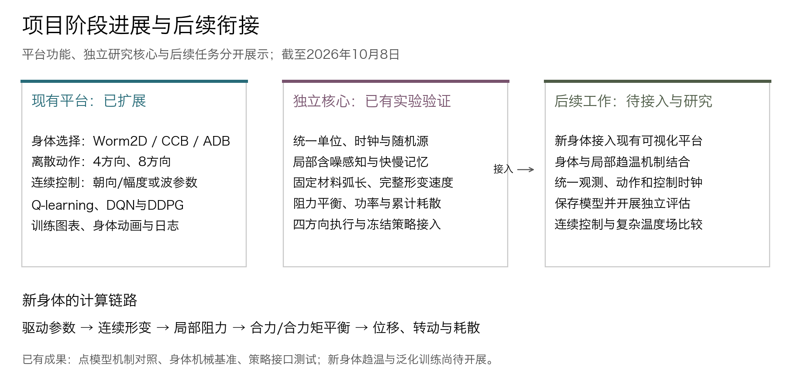
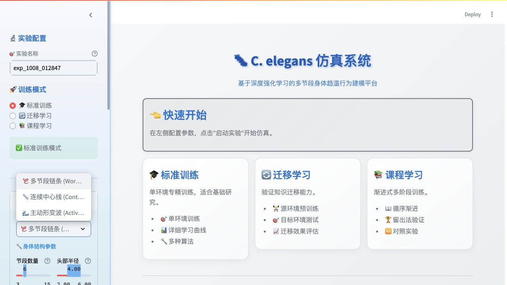
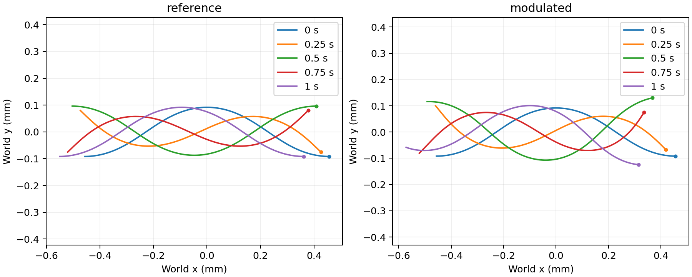
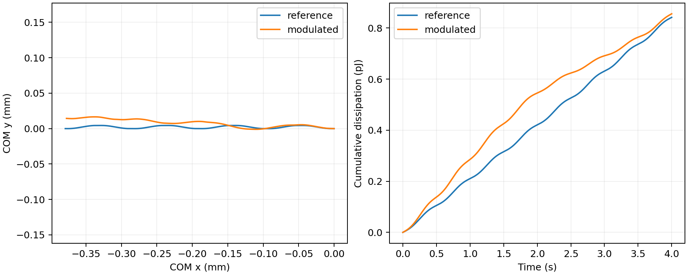
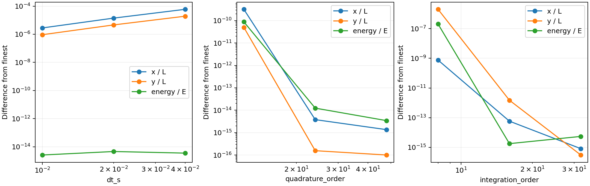
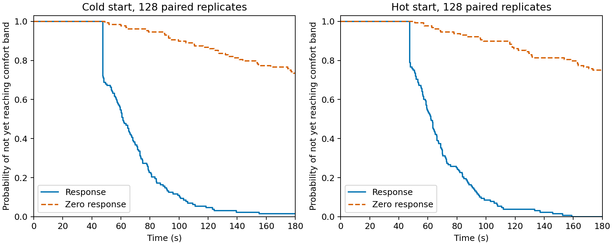
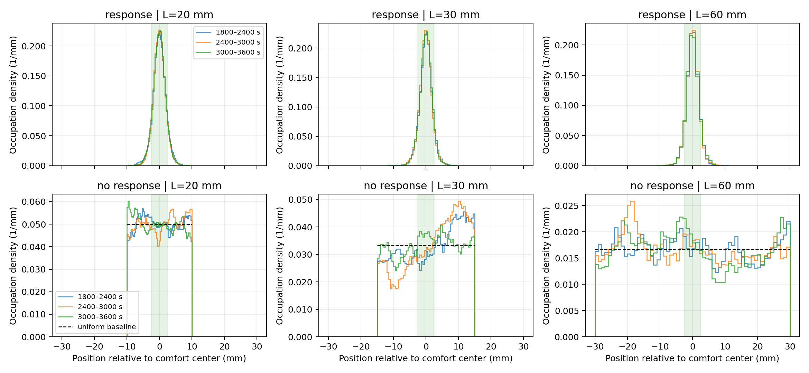
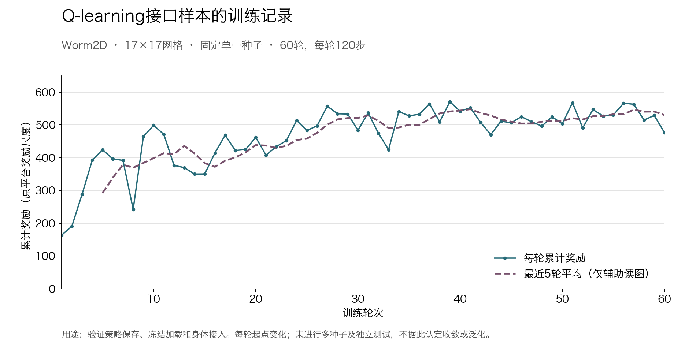
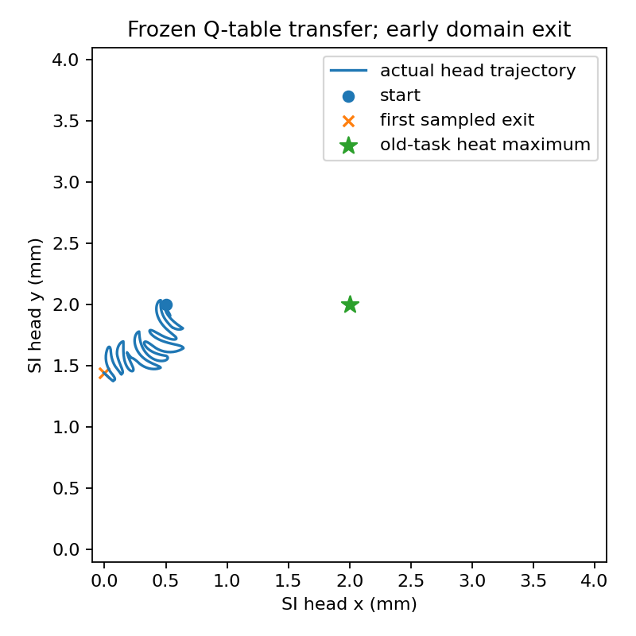

# 软体仿生线虫项目阶段进展汇报与讲述稿

> 本文保留此前阶段的快照。2026-10-08后续连续导航优化与实测结果见 [最新验证报告](../docs/reports/ccb-continuous-navigation-2026-10-08.md)，CCB现使用相对转向、14维AC观测与连续奖励。

汇报日期：2026年10月8日。主要实验数据来自2026年10月4日归档批次；本次整理补充平台截图、进展结构图和已保存训练记录的曲线，不新增训练实验。

## 一、本阶段的主要工作

本阶段，我主要围绕身体模型、趋温机制和实验验证三个方面开展工作。基于前期已有的多节段身体、离散方向控制、强化学习和温度场平台，我们扩展了身体与动作的选择，并独立构建了采用统一物理单位的研究核心。目前已经形成点模型的含噪趋温对照结果、身体推进与耗散的机械基准，以及旧策略接入新身体的实际记录。

后续的目标是把这些工作连接起来：让经过验证的身体通过局部感知在温度场中运动，再研究连续控制、身体参数与趋温表现之间的关系。因此，这一阶段既保留了原平台的演示与训练能力，也补充了用于解释运动机制的物理和统计依据。

**图1：当前工作的三个部分。**左侧是已经扩展的可视化平台，中间是已有独立实验验证的研究核心，右侧是尚待完成的接入和研究任务。新力学核心目前仍以归档图表展示，没有接入平台的身体选择菜单。

> **讲述补充：**我这次的工作既包括原平台的扩展，也包括独立的物理核心构建。下面分别介绍已经完成的部分，以及这些结果为什么支持下一步研究。

## 二、原平台已经支持不同身体与控制方式

前期平台以多节段链式身体为基础，主要通过离散方向控制头部位置，再让后面的身体节点跟随。目前平台增加了连续中心线身体CCB和主动形变身体ADB，并提供对应的动作与学习算法选择。

CCB用采样中心线表示身体，头部运动后通过长度和弯折修正更新身体形状。它既可以使用4方向、8方向，也可以由DDPG输出连续朝向和运动幅度。ADB则把动作改为波幅、频率和弯曲偏置，通过形变与介质阻力计算实际平移和转动。因此，两种连续控制的区别在于：CCB直接给出运动意图，ADB给出身体怎样摆动。

**图2：现有平台的身体模型选择入口。**截图来自当前运行的界面，显示Worm2D、连续中心线和主动形变波三个选项。本图展示功能入口，截图过程中没有启动训练。

平台的Q-learning、DQN、Dueling DQN及DDPG路径已经实现，但算法接入与训练效果需要分别评价。对于CCB和ADB，目前还没有归档到足以说明稳定收敛、跨温度场泛化的DDPG评估结果。近期也统一了绘图模块的中文字体设置，用于改善导出动画的中文显示。

> **讲述补充：**平台现在能够比较不同身体表示和动作形式；其中哪些控制方式更适合身体趋温，还需要在统一任务中开展实验。

## 三、新身体力学能够计算实际推进、转向与耗散

为了使身体运动和能量指标具有一致的物理解释，我们在独立核心中重新构建了规定形变身体。身体采用固定材料弧长表示，通过沿身体传播的切角行波重建中心线；幅值、相位和弯曲偏置的时间变化都计入局部形变速度，再由切向、法向黏性阻力及整体合力、合力矩平衡，求出平移速度和角速度。

这一构建与直接指定前进速度的区别在于：控制输入规定身体怎样形变，而实际移动速度由形变和介质作用共同决定。当前采用局部阻力近似，尚未加入完整流体耦合和弹性本构。

**图3：一个周期内的身体位形。**左图reference为固定行波，右图modulated为幅值、相位及偏置随时间调制的驱动；不同颜色对应0、0.25、0.5、0.75和1秒，圆点标示同一材料端点。坐标单位为毫米。图中可以看到摆动过程中的形状变化，长度保持另由几何检查验证。

参考实验采用1毫米身体、0.6弧度切角幅值、1赫兹频率和法向/切向阻力比2。固定行波运行4秒，净位移约0.379毫米，净平均速度约0.0948毫米每秒。身体在推进过程中不断发生形变，并产生正的介质耗散。

**图4：身体运动和机械耗散记录。**左图是身体材料中心的轨迹，右图是累计介质耗散；蓝线为固定行波，橙线为调制驱动。4秒累计耗散分别约0.841和0.855皮焦耳。阻力绝对值仍是未标定的工作参数，这些数值用于模型内核算和比较，不能作为真实线虫的生物能耗。

身体验证除了检查能否移动，还检查形变速度是否与几何时间变化一致、整体力与力矩是否平衡，以及时间步和空间积分加密后结果是否稳定。已有16组幅值与阻力比扫描、12组数值收敛比较，并完成独立密网格求解核查。

**图5：时间与空间数值分辨率检查。**三幅图分别改变时间步dt_s、阻力积分阶数quadrature_order和几何积分阶数integration_order；纵轴为相对于该组最细设置的归一化差异，采用对数刻度。时间步减小、空间积分加密后，位置等指标差异趋于减小；极小差异附近的波动可能受浮点精度影响。该图对应固定行波，调制驱动的时间步检查另保存在验证记录中。

> **讲述补充：**目前已经能在同一套模型中计算身体怎样摆动、怎样移动以及耗散多少。现阶段采用规定形变，下一步加入弹性后，才进一步研究受力如何决定实际形状。

## 四、局部含噪感知与记忆已经形成趋温对照结果

为单独研究信息和决策机制，我们先采用一维点模型。个体不读取全局温度场、真实梯度或舒适区坐标，只接收当前位置的含噪温度。控制器将与舒适温度的偏差分别存入快、慢两种记忆：近期误差减小时降低反向概率，误差增大时提高反向概率，从而形成统计上的趋温偏置。

这一部分使用规则记忆控制器，没有神经网络训练。我们设置响应组和关闭趋势响应的对照组，每对共享随机条件，以比较记忆响应是否改善行为。到达率表示观察时间内至少进入一次舒适带的轨迹比例；驻留率表示在舒适带内的时间占比，两者分别反映“能否找到”和“能否停留”。

短时实验共544对，其中噪声—记忆扫描288对，另用新种子进行冷、热起点各128对的参考实验。参考任务采用30毫米区域、静态线性温度梯度和5毫米宽的舒适带，观察窗口为180秒。

**图6：参考条件下首次进入舒适区的统计结果。**左、右图分别为冷侧和热侧起点，每侧128对；蓝色实线为响应组，橙色虚线为无响应组。纵轴是尚未进入舒适区的轨迹比例，下降越快说明进入越早。180秒内，冷侧到达率为98.44%对26.56%，热侧为100%对25%。

随后进行三种域宽的长时比较：每种域宽冷、热起点各32对，共192对，每条轨迹运行3600秒。舒适带宽度均为5毫米，最后600秒的驻留结果如下。

| 区域宽度 | 响应组驻留率 | 无响应组驻留率 |
| --- | ---: | ---: |
| 20毫米 | 82.33% | 24.90% |
| 30毫米 | 82.86% | 18.54% |
| 60毫米 | 82.19% | 9.40% |

**图7：三个后期时间块的位置占据分布。**三列对应20、30、60毫米区域，上排为响应组，下排为无响应组；横轴是相对于舒适区中心的位置，纵轴是占据概率密度。阴影标示舒适带，黑色虚线是均匀分布基准。响应组在舒适区附近集中；各小图纵轴范围不同，不能通过曲线高度直接比较驻留率，应结合上表。

这些结果说明，在当前点模型、温度场和参数下，局部含噪测温与趋势记忆能够提高趋温表现，并在所选后期窗口维持较高驻留。后期块已有稳定性筛查，但仍不作严格稳态结论。身体柔软性和强化学习泛化尚未进入这组实验。

> **讲述补充：**点模型先验证一个基础问题：没有全局温度地图，只有局部带噪测温，是否仍能形成有效趋温行为。现在已有配对统计结果，下一步把同样的信息条件接到真实运动的身体上。

## 五、已有训练样本与策略迁移揭示了时间尺度问题

目前可追溯的训练资产包括一份用原Worm2D程序新训练的Q表及逐轮记录。训练使用17×17网格、固定随机种子，共60轮，每轮120步，总计7200次更新。该样本主要用于验证精确Q值保存、冻结加载和新身体接入，并非此前组员的历史训练权重。

**图8：根据已有记录重绘的Q-learning训练曲线。**实线为每轮累计奖励，虚线为最近5轮平均。记录显示后期奖励整体高于初期；但每轮起点不同，而且只有单一种子、没有配套独立评估，不能仅凭这条曲线判断稳定收敛或泛化。任务仍采用原平台奖励定义，与点模型的舒适温度任务不同。

新身体已经能够接收四方向命令。命令先转换为驱动目标，幅值、频率和偏置以有限响应时间变化，再由身体力学产生实际运动。因此，“向上”不会立即变成沿竖直方向移动。

**图9：四方向命令的身体执行结果。**左图是各方向保持24秒的中心轨迹，中图是身体轴与目标方向的误差，右图是左→上→右→下的连续指令轨迹。初始身体朝左；按方向误差首次连续1秒不超过0.25弧度的判据，90度转向约需9—10秒，180度约需14秒。这是给定参数下的执行器基准，不是训练出的导航策略。

冻结Q表接入也已经实际运行。在一次17×17网格映射到4毫米×4毫米区域的实验中，策略执行44次指令，头部于8.70秒首次离开区域，随后终止，没有完成导航。

**图10：一次未完成导航的冻结策略迁移。**蓝线是实际材料头部轨迹，蓝点是起点，橙叉是首次采样离域位置，绿星是旧任务热峰。策略评估过程中Q表保持不变。结果限定于该样本、坐标映射、初态和执行参数，不能据此判断所有旧策略均无法迁移。

这次实验提示了一个需要研究的问题：旧网格动作能够立即换向，而身体转向需要数秒；本次控制周期为0.2秒，快速连续命令可能与身体的实际响应不匹配。任务目标、信息条件及边界也存在差别，后续将逐项统一，再比较动作保持时间并重新训练，避免把所有迁移差异归于算法优劣。

> **讲述补充：**训练资产和身体执行接口已经建立；迁移实验暴露了离散动作与连续身体之间的差异，接下来需要围绕实际响应时间设计控制和训练。

## 六、验证基础与下一阶段安排

各阶段已分别保存配置、原始记录、指标和图表。身体部分检查材料长度、几何速度、力与力矩平衡、耗散及数值收敛；点模型部分进行配对统计、指标独立复算和完整轨迹重演；策略接口检查冻结权重、动作映射、有限响应和离域终止。最近一次完整回归记录为119项通过，其中包括4项新增字体选择测试。测试数量用于说明检查范围，趋温效果和训练质量仍由对应实验指标评价。

下一阶段准备集中完成以下三项工作：

1. **接入新身体的可视化。**在现有平台增加新力学身体选项，展示实际位形、驱动命令与有效驱动、轨迹、功率和累计耗散，保留Worm2D、CCB和旧ADB作为对照。
2. **形成身体版局部趋温实验。**把含噪测温和快慢记忆接入新身体，在统一舒适温度任务下比较响应与无响应，记录到达率、驻留率、温度误差和耗散，并研究动作保持时间的影响。
3. **完善连续控制训练与独立评估。**先统一观测、动作边界、奖励、终止和时钟，补齐模型保存与冻结评估，再开展多随机种子训练和未参与训练的温度场测试。弹性身体与刚度比较在当前机械基准上继续推进。

目前希望进一步明确的是：控制更新应如何与身体转向时间配合，以及在同一物理模型中，形变参数控制相较方向命令能否改善趋温与耗散表现。后续实验将围绕这两个问题展开。

## 结束时的简要总结

这一阶段已经完成了平台功能扩展、点模型趋温对照和新身体机械基准。点模型提供了局部含噪感知与记忆的统计依据；身体模型能够计算实际推进、转向与介质耗散；旧策略接入实验进一步显示了动作时间尺度的重要性。接下来主要是将这些成果接入同一平台和任务，形成身体版趋温实验，再开展连续控制与复杂温度场比较。

## 补充材料

- [身体力学与策略接入报告](docs/reports/progress-2026-10-04-body.md)：物理参数、验证方法和迁移条件。
- [点模型统计报告](docs/reports/progress-2026-10-04.md)：544对短时实验、指标定义与统计区间。
- [长时趋温基准报告](docs/reports/progress-2026-10-04-closure.md)：192对长时实验及边界、后期块检查。
- [原平台算法与可调参数说明](原平台算法与可调参数说明.md)：模型、算法及参数实际生效范围。
- [本稿配图来源与核查说明](讲述稿配图/配图来源与核查.md)。
